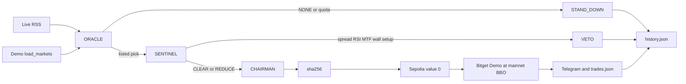

# CHRONOS-NEXUS

```text
 ██████╗██╗  ██╗██████╗  ██████╗ ███╗   ██╗ ██████╗ ███████╗
██╔════╝██║  ██║██╔══██╗██╔═══██╗████╗  ██║██╔═══██╗██╔════╝
██║     ███████║██████╔╝██║   ██║██╔██╗ ██║██║   ██║███████╗
██║     ██╔══██║██╔══██╗██║   ██║██║╚██╗██║██║   ██║╚════██║
╚██████╗██║  ██║██║  ██║╚██████╔╝██║ ╚████║╚██████╔╝███████║
 ╚═════╝╚═╝  ╚═╝╚═╝  ╚═╝ ╚═════╝ ╚═╝  ╚═══╝ ╚══════╝ ╚══════╝
███╗   ██╗███████╗██╗  ██╗██╗   ██╗███████╗
████╗  ██║██╔════╝╚██╗██╔╝██║   ██║██╔════╝
██╔██╗ ██║█████╗   ╚███╔╝ ██║   ██║███████╗
██║╚██╗██║██╔══╝   ██╔██╗ ██║   ██║╚════██║
██║ ╚████║███████╗██╔╝ ██╗╚██████╔╝███████║
╚═╝  ╚═══╝╚══════╝╚═╝  ╚═╝ ╚═════╝ ╚══════╝
```

### Wall Street sleeps. The Nexus does not.

**Chronos-Nexus** is a standalone, enterprise-grade, open-source multi-agent trading system. Three agents share one hourly cycle: **ORACLE** reads the live wire, **SENTINEL** can veto any idea, and **CHAIRMAN** (Qwen 3.8 Max) is the only voice allowed to turn a cleared idea into a Bitget Demo order.

The model decides. Python binds the veto. Private orders stay on Bitget Demo. Prices, marks, and PnL come from Bitget, not from a local simulator.

| Field | Value |
|---|---|
| **System** | General-purpose agentic trading desk |
| **Style** | Event-driven, multi-agent |
| **Mode** | Paper / Demo only |
| **Version** | `1.3.0-desk` (`VERSION` in `main.py`) |
| **Default contract** | `rNVDA/USDT:USDT` |
| **Cycle** | 3600 seconds. A cycle fault sleeps 300 seconds and continues |
| **Repository** | [github.com/Jubayir-hub-69/Chronos-Nexus](https://github.com/Jubayir-hub-69/Chronos-Nexus) |
| **License** | MIT |

[](https://www.python.org/)
[](https://hackathon.bitgetops.com/v1/chat/completions)
[](https://www.bitget.com/api-doc/classic/demotrading/restapi)
[](#sentinel--risk-manager)
[](https://sepolia.arbiscan.io/)
[](#exhaustive-command-and-usage-guide)

This tree does **not** mint or redeem rTokens against NAV. It trades news-driven direction on Bitget Demo USDT-M stock and rToken perpetuals, and it lets the operator place separate Demo Spot orders from Telegram.

---

## What the desk actually does

1. **Sense.** Pull live RSS from Yahoo Finance, CNBC, MarketWatch, and CoinTelegraph. Score the tape in Python. Ask Qwen for a thesis on one unoccupied Demo contract, or `NONE`.
2. **Judge.** SENTINEL measures 15m / 1h / 4h candles, RSI(14), spread, the order book, volume, and the daily budget. A hard rule vetoes even when the news is bullish.
3. **Act.** CHAIRMAN hashes the board minutes, anchors `sha256` in a **0-value** Arbitrum Sepolia transaction, then sends a Bitget Demo USDT-M market order pegged to the live mainnet best bid or ask.
4. **Mind the book.** The same process trails stops, books the first half at +25% PnL, and can close a name when the thesis breaks. Telegram reports the live book. It does not invent a balance.

The local console prompt is `nexus>`. The same command desk serves that prompt and Telegram.

---

## Architecture

```text
 LIVE RSS (Yahoo / CNBC / MarketWatch / CoinTelegraph)
      │
      ▼
 ORACLE     sentiment 0–100, conviction clipped to the NLP score
      │
      ├─ idle / timeout / 429 quota ──► STAND_DOWN
      │
      ▼ one unoccupied USDT-M name, or NONE
 SENTINEL   15m RSI · 1h confirm · 4h regime · book · volume · 75% setup
      │
      ├─ VETO / daily halt / occupied book ──► Telegram + trades.json
      │
      ▼ CLEAR or REDUCE
 CHAIRMAN   Qwen 3.8 Max · sha256 · Arbitrum Sepolia value = 0
      │
      ▼
 Bitget Demo USDT-M  ·  mainnet BBO peg  ·  margin stop  ·  +25% scale-out
      │
      ▼
 Telegram alerts + data/logs/trades.json + data/history.json
 sleep 3600s
```



| Callsign | Role | File | What it owns |
|---|---|---|---|
| **ORACLE** | Analyst | `agents/analyst.py` | Live RSS, session clock, NLP sentiment, one symbol or `NONE` |
| **SENTINEL** | Risk | `agents/risk_manager.py` | Binding veto. Spread, RSI, candles, MTF, walls, volume, 75% setup, daily limits |
| **CHAIRMAN** | Executive | `agents/executive.py` | Final action, minutes hash, Sepolia attest, Demo execute or `STAND_DOWN` |

Python overrides the model on veto, idle tape, timeout, quota, an occupied symbol, and the daily halt. Qwen cannot open a cash symbol such as `BTC/USDT`. Crypto perpetuals such as `BTC/USDT:USDT` are excluded from the equity universe (`_CRYPTO_DENY` in `connectors/bitget_paper.py`).

### ORACLE — wire, sentiment, thesis

ORACLE is not a bull/bear flag. Each headline starts at **neutral 50**. Lexicon hits move the raw score. Source credibility and recency shrink that move back toward 50:

```text
sentiment = clip(50 + (raw − 50) × credibility × recency, 0, 100)
```

| Input | Weight in `core/news.py` |
|---|---|
| CNBC, Bloomberg | 1.00 |
| Reuters | 0.98 |
| WSJ | 0.96 |
| Financial Times | 0.95 |
| Yahoo Finance | 0.88 |
| MarketWatch | 0.82 |
| CoinTelegraph | 0.52 |
| Recency | ≤3h = 1.00 · ≤12h = 0.90 · ≤24h = 0.75 · ≤48h = 0.50 · older = 0.25 |
| Macro / high impact | Fed, FOMC, CPI, NFP, earnings, guidance, SEC, FDA — 1.25× |
| Conflict | Bulls ≈ bears on the focused tape. Conviction capped at **20** |

Conviction:

```text
clip(50 + 0.9 × 100 × |sentiment − 50| / 50 × credibility × recency × impact, 0, 100)
```

Qwen writes the thesis. Python **clips** model conviction to that NLP score, so a 90-conviction BUY cannot ride a 51 tape. A conflicted or ~50 wire returns `NONE` / `STAND_DOWN`. There is no default NVDA when the wire is empty.

Feeds actually requested (`RSS_FEEDS` in `agents/analyst.py`):

| Source | URL |
|---|---|
| Yahoo Finance | `https://finance.yahoo.com/news/rssindex` |
| CNBC | `https://www.cnbc.com/id/100003114/device/rss/rss.html` |
| MarketWatch | `https://feeds.marketwatch.com/marketwatch/topstories/` |
| CoinTelegraph | `https://cointelegraph.com/rss` |

If the wire cannot be fetched, the cycle stands down. It does not substitute canned headlines.

After a real stand-down (not an API failure), `core/neutral_lane.py` may scan the unoccupied book. A quiet US cash session (pre-market, overnight, weekend, after-hours) or a neutral wire, with 24h quote volume of at least **250,000 USDT** and a TA score of at least **70**, can still be promoted. A directional cash-session tape keeps the **75** rail. Conflict, an opposing wall, a volume fakeout, or a news fight still veto.

### SENTINEL — risk manager

SENTINEL's veto is absolute. A bullish headline does not override an overbought 15-minute tape.

| Layer | Rule |
|---|---|
| **15m RSI(14)** | Wilder RSI on Bitget OHLCV. **BUY veto when RSI ≥ 70.** **SELL veto when RSI ≤ 30.** Exact strings: `VETO: RSI Overbought despite bullish news` and `VETO: RSI Oversold despite bearish news`. If RSI cannot be measured, the rail is skipped (fail-open). Fallback candles are 1h. |
| **Candle structure** | A break against the news side is `VETO: Candle structure contradicts news thesis`. |
| **1h** | Confirmation. Structure, else bias, else SMA(20). |
| **4h** | Regime. Agreement with 1h is `ALIGNED`. Disagreement is `CONFLICT` and a hard veto: `VETO: Higher-timeframe trend disagrees`. If 1h/4h were not measured, this rail is skipped. |
| **Spread** | Bid-ask spread above **1.5%**, or a dark/crossed book, is `Illiquid Market / High Spread`. Size is zero. |
| **L2 wall** | `(bid volume − ask volume) / total` from `fetch_order_book`. A BUY is blocked by a sell wall (size ≥ 3× the median, within 0.8% of last) or imbalance ≤ −0.35. String: `VETO: Opposing order-book wall`. |
| **Volume profile** | 20-bin point of control and a 70% value area. A break outside the value area with relative volume under 1.1 is `VETO: Breakout lacks volume confirmation`. |
| **VWAP** | Typical price × volume. On an aligned tape, a close more than 1.2% from VWAP waits: `VETO: Price extended — waiting for pullback`. |
| **Setup score** | Ensemble below **75** is `VETO: Setup confidence below 75 — wait for a cleaner TA tape`. |
| **Daily halt** | 4 UTC-day entries, 3 wins, any stop-out, chop/downtrend, or a spent 6% equity budget. SENTINEL cannot override the halt. |

Setup ensemble, used when 1h and 4h are measured (`SETUP_THRESHOLD = 75.0` in `core/ta.py`):

```text
score = 0.10·news + 0.22·HTF + 0.18·entry + 0.18·volume
      + 0.16·book + 0.10·extension + 0.06·conviction
```

`MIXED` higher-timeframe alignment scores 70 on the HTF term. Extension is a score penalty. `CONFLICT` is still a hard veto. Unmeasured higher timeframes do not invent a 50 and kill the trade.

| Condition | Action | Size |
|---|---|---|
| Setup clears and verdict is `CLEAR` | `EXECUTE` | Inside the 6% daily equity cap |
| Verdict is `REDUCE` | `EXECUTE` | `max_notional_usdt × size_multiplier` |
| `VETO`, setup below the rail, HTF conflict, wall, fakeout, spread | `STAND_DOWN` | Zero. Python wins |
| ORACLE idle (`NONE` or conviction 0) | `STAND_DOWN` | Zero |
| Qwen timeout, 503, or 429 quota | `STAND_DOWN` | Zero. The daemon stays up |
| Symbol already open | Skip the new entry | Anti-stack. ORACLE does not see occupied names |
| UTC day: 4 entries, or 3 wins, or any stop, or chop/downtrend | Hard stand-down | Zero new entries |

Quota stand-down string, exact:

```text
Bitget Qwen API quota reached. System safely standing down until limits reset.
```

Timeout stand-down string: `VETO: API Timeout`.

### CHAIRMAN — Qwen 3.8 Max

CHAIRMAN is the executive. It does not bypass SENTINEL. On `CLEAR` or `REDUCE` it locks the action, hashes the board minutes, attests, and calls the Demo connector. On veto or idle it writes `STAND_DOWN` and does not open a position.

| Setting | Value |
|---|---|
| Client | `openai` Python SDK in `core/llm.py` |
| Completion endpoint | `https://hackathon.bitgetops.com/v1/chat/completions` (`QWEN_BASE_URL`) |
| SDK base | `https://hackathon.bitgetops.com/v1` so the SDK appends `/chat/completions` once |
| Primary wire | Chat completions. The Responses API is only a fallback if chat fails for a reason other than timeout or quota |
| Model | `qwen3.8-max`. Empty, `auto`, `default`, `qwen-max`, `qwen`, and `qwen-2.5-72b-instruct` resolve to `qwen3.8-max` |
| Thinking | Disabled (`enable_thinking: false`, and `reasoning.effort = none` on the responses fallback) |
| Timeout | 90 seconds (`LLM_TIMEOUT_S`) |
| Max tokens | 8192 (`LLM_MAX_TOKENS`) |
| Key | `QWEN_API_KEY` in `.env`. Direct DashScope is not the target |

Attestation (`connectors/arbitrum.py`):

- Chain **421614** (Arbitrum Sepolia). A different chain id refuses the ping.
- Transaction `value` is **0**. It is a self-transfer. The payload is `CHRONOS-NEXUS/v1:` plus the ASCII sha256 digest.
- A missing `ARBITRUM_PRIVATE_KEY` or a wallet that cannot pay gas skips the anchor (`skipped`) and records the reason. It does not invent a hash on chain.
- Explorer pattern: `https://sepolia.arbiscan.io/tx/{tx_hash}`.

Two anchors already stored in `data/logs/trades.json`:

| Logged UTC window | Transaction |
|---|---|
| 2026-09-10 | [`0x1b3ecc83…556fe721`](https://sepolia.arbiscan.io/tx/0x1b3ecc83c316e46dc7b18edb3b86da96c04a57d8af6eb68765542b96556fe721) |
| 2026-09-10 | [`0xacf4e0ea…fde73b24`](https://sepolia.arbiscan.io/tx/0xacf4e0ea402cc66e03984e307c349094be088acc7b499e6eb0a381aefde73b24), then Demo order `1481850718917124096` on `NVDA/USDT:USDT` |

Attester recorded on those rows: [`0x9AFe5CeF11fC10756faef213f7A30D9873B5d372`](https://sepolia.arbiscan.io/address/0x9AFe5CeF11fC10756faef213f7A30D9873B5d372).

---

## Hybrid execution

Two order routes. Both are real Bitget Demo calls. Neither uses a made-up wallet.

| Who | Market | CCXT route | Behavior |
|---|---|---|---|
| **Operator Telegram** | Demo **Spot** | `type=spot`, `uta=False` | `BUY 10 USDT BTC`, `NVDA/USDT BUY $10`, `/buy NVDA 10`. Spends Spot USDT. No leverage. No SL/TP. |
| **ORACLE → SENTINEL → CHAIRMAN** | Demo **USDT-M** stock and rToken perpetuals | `type=swap`, `productType=USDT-FUTURES`, `uta=False` | Hourly cycle only. Cash symbols are refused (`NOT_PERP`). Crypto majors stay off the universe. |
| **Perception** | Keyless **mainnet** spot + swap | Public CCXT client, no keys, no sandbox | Last, bid, ask, markPrice, L2, OHLCV. Marks and PnL use this tape. |

`defaultType` is restored to `swap` after a Spot order so the AI cycle does not inherit a Spot default.

Bitget's unified account returns the same asset list for every `type`. Balance and position reads pass **`uta=False`** so Spot hits `v2/spot/account/assets` and USDT-M hits `v2/mix/account/accounts` with `productType=USDT-FUTURES`. The two wallets are printed separately. They are not added together, and one is not copied onto the other.

| Rail | Client | Lock |
|---|---|---|
| Execution | Authenticated CCXT Bitget | `set_sandbox_mode(True)` is the first call after construct. Header `PAPTRADING: 1`. |
| Perception | Second CCXT Bitget, no API key | `fetchMarkets` covers spot and swap. Never a sandbox print. |

**Fill peg.** BUY and cover lift the **best ask**. SELL and close hit the **best bid**. The mid is not used. A swap or rToken entry is refused when the best bid/ask diverges from `markPrice` by more than **2%** (`BBO_MARK_DIVERGENCE_PCT`). Spot tickers with no mark (BGB is the usual case) still price from last, bid, and ask. Logs use `price_source=mainnet_bbo`. A close keeps the original entry.

**Fees.** `options.deduct=on`. Boot tries UTA `v3/account/switch-deduct`, then classic `POST /api/v2/spot/account/switch-deduct`. Demo skips the v3 route when Bitget returns 40404. A missing route leaves BGB fee-deduct off and does not stop the process. Deduct is never placed on `create_order` bodies, because Bitget rejects unknown order parameters. The taker rate used when a simulated fee is required is **6 bps** (`TAKER_FEE_RATE = 0.0006`). A live fill stamps the wallet after minus before. A missed read is `0.0` with source `unmeasured`, not a fake profit.

**Leverage.** AI swap orders use `SWAP_LEVERAGE = 5`. Spot orders do not.

### Real-time PnL and protective orders

Unrealized PnL is `(mark − entry) × qty` for a long and the inverse for a short. Entry comes from the exchange average open price. A missing entry is `n/a`. The mark is never copied into the entry. The live mark is the mainnet ticker in this order: mark, last, bid/ask. It does not fall back to the entry.

| Control | Implementation |
|---|---|
| Stop | `sl_margin_frac ×` invested margin. High risk uses **50%** of margin. Low risk uses **100%**. This is not a flat 2% price stop. |
| ATR path | When ATR is present: 1.5× ATR stop, floored at 1.2% and capped at 5% of price. Take-profit is 2.5× that stop distance, floored at 3% and capped at 12%. Shorts invert both. |
| First take-profit | **+25% PnL** (`SCALE_OUT_PCT = 0.25`), then a reduce-only close of **50%**. A slice under Bitget's minimum is skipped. |
| Runner | After the partial, the stop ratchets. Giveback and trail live in `core/positions.py`. |
| Thesis exit | The hourly scan can close an open name on a structure break against the position. |
| Anti-stack | One open name is not entered again. Occupied symbols are hidden from ORACLE. |
| Daily cap | At most **4** entries per UTC day. **3** wins, or any stop-out, or a choppy/downtrend tape, halts new entries. New margin is clipped to **6%** of futures equity (`fetch_account_equity` / `fetch_balance` on the USDT-M ledger only). |
| Close size | Bitget `45113` / `45112` / `45104` / `45103` (max order value) slices the close. Default slice is 100 contracts or 8000 USDT, also bounded by the market amount and cost maximums. On those codes the CCXT backoff stops, the slice is halved, the loop sleeps 0.5s, and it repeats until flat (max 40). A remainder under **1 USDT** (`45110`) is dust: status `DUST`, no error. An order id is not a fill. `CLOSED` is reported only after the live position is re-read as flat. |

Manual opens on the AI book (`/buy` with no size, `/open`, `/long`, `/short` as desk commands) are refused. The operator Spot syntax below is the only manual entry, and it never attaches a futures stop.

---

## Role-based Telegram access

`TELEGRAM_CHAT_ID` is the operator. The check compares the **chat id** on the update to that value (`TelegramCommandLoop._is_operator`). In a private chat the chat id and the user id are the same number. Every other chat is answered. Updates are not dropped.

Poll timeouts: connect 5 seconds, read 25 seconds, HTTP retries 0. A stall logs `connection to api.telegram.org timed out` with the bot token stripped, and the loop keeps polling. The offset is `data/telegram_offset.json`.

On start, `setMyCommands` registers this menu: menu, positions, close, closeall, price, balance, pnl, status.

| Audience | Commands | What happens on an execution attempt |
|---|---|---|
| **Operator** (`TELEGRAM_CHAT_ID`) | Full desk, plus Spot `BUY` / `SELL` text | Orders are sent |
| **Guest** | `/help`, `/price`, `/status`, `/positions`. `/start` and `/menu` show the guest card | Exact reply: `Access Denied: Operator command only.` |
| **Guest buttons** | Live Market Status, Open Positions | PnL, balance, and Force Close All are refused with the same sentence |
| **Operator buttons** | Live Market Status, My Real PnL, Open Positions, Force Close All, Dashboard | Force Close All shows the live USDT-M book, then `CONFIRM FLATTEN` runs `/closeall` |

Guest `/start` and `/menu` greet the sender by Telegram name and print **Telegram User ID**. That card is how a second person sees their id. It does not grant operator rights. Operator rights exist only when `.env` `TELEGRAM_CHAT_ID` equals that chat.

If the token or chat id is empty, the notifier and the command loop disarm. The hourly cycle can still run in the terminal.

The local `nexus>` prompt uses the same `CommandDesk` as the operator. It is not a guest session.

---

## Installation and setup

### Prerequisites

- **Python 3.10+**. This workspace runs on Python 3.12.
- A Bitget **Demo** API key, secret, and passphrase. Live keys are refused by `BITGET_PAPER_TRADING`.
- A **`QWEN_API_KEY`** for `qwen3.8-max`.
- Demo USDT in the Bitget Demo futures wallet if you want the hourly cycle to size orders. Spot USDT is a separate wallet.
- Optional but required for Telegram: a bot token from [@BotFather](https://t.me/BotFather) and your numeric chat id.
- Optional for on-chain proof: an Arbitrum **Sepolia** account with a little test ETH. The transaction value is 0. Gas is not.

### Clone and install

```bash
git clone https://github.com/Jubayir-hub-69/Chronos-Nexus.git
cd Chronos-Nexus
python -m venv .venv
```

Windows PowerShell:

```powershell
.\.venv\Scripts\Activate.ps1
python -m pip install --upgrade pip
pip install -r requirements.txt
copy .env.example .env
```

macOS or Linux:

```bash
source .venv/bin/activate
python -m pip install --upgrade pip
pip install -r requirements.txt
cp .env.example .env
```

Dependencies in `requirements.txt`: `rich`, `openai>=1.68.0`, `python-dotenv`, `web3`, `ccxt>=4.4.80`, `pydantic`, `pydantic-settings`, `feedparser`, `requests`, `pillow`.

### Environment file

Create **`.env` in the repository root**, next to `main.py`. `core/config.py` loads that path with `python-dotenv` (`override=False`, so a variable already set in the process wins). **Do not commit `.env`.** The example file is `.env.example`.

```dotenv
# Qwen. The completion URL is hardcoded in core/config.py. Do not point this at DashScope.
QWEN_API_KEY=your_qwen_api_key
QWEN_MODEL=qwen3.8-max

# Bitget Demo only. Bitget app → Demo trading → API management → create a Demo key.
BITGET_API_KEY=your_demo_api_key
BITGET_API_SECRET=your_demo_secret
BITGET_PASSPHRASE=your_demo_passphrase
BITGET_PAPER_TRADING=true
BITGET_SYMBOL=rNVDA/USDT:USDT

# Arbitrum Sepolia. Testnet key only. 0-value proof transactions.
ARBITRUM_SEPOLIA_RPC=https://sepolia-rollup.arbitrum.io/rpc
ARBITRUM_SEPOLIA_CHAIN_ID=421614
ARBITRUM_PRIVATE_KEY=0xyour_sepolia_private_key

# Telegram. TELEGRAM_CHAT_ID is the operator. Everyone else is a guest.
TELEGRAM_BOT_TOKEN=123456:ABC-your-bot-token
TELEGRAM_CHAT_ID=123456789
```

| Variable | Required | Where it is used |
|---|---|---|
| `QWEN_API_KEY` | Yes, for decisions | `QwenCortex`. Empty key: cortex is offline and the desk stands down |
| `QWEN_MODEL` | No | Defaults to `qwen3.8-max` |
| `BITGET_API_KEY` | Yes | Demo execution client |
| `BITGET_API_SECRET` | Yes | Demo execution client |
| `BITGET_PASSPHRASE` | Yes | Bitget API passphrase |
| `BITGET_PAPER_TRADING` | Yes, must be `true` | `false` / `0` / `off` refuses boot |
| `BITGET_SYMBOL` | No | Preferred contract. Default `rNVDA/USDT:USDT` |
| `ARBITRUM_SEPOLIA_RPC` | No | Default `https://sepolia-rollup.arbitrum.io/rpc` |
| `ARBITRUM_SEPOLIA_CHAIN_ID` | No | Default `421614`. A mismatch refuses the chain ping |
| `ARBITRUM_PRIVATE_KEY` | No | Without it, attestation is skipped and the reason is logged |
| `TELEGRAM_BOT_TOKEN` | For Telegram | Empty disarms alerts and the command loop |
| `TELEGRAM_CHAT_ID` | For Telegram | Numeric chat id of the operator |

**Finding `TELEGRAM_CHAT_ID`.** In a private chat it is your Telegram user id.

1. Put the bot token in `.env`.
2. Set `TELEGRAM_CHAT_ID` to any placeholder number that is not yours, and start the bot.
3. Open the bot and send `/start`. The guest card prints `Telegram User ID`.
4. Stop the process, put that number in `TELEGRAM_CHAT_ID`, and start again.
5. Send `/menu`. You should see the operator dashboard, not the guest card.

A group chat id is negative. This desk is built for a private operator chat.

**Bitget Demo keys.** Create them while the Bitget account is in Demo mode. A live key will not pass the paper lock, and this process must not be aimed at live trading. `LIVE_TRADING_ENABLED` in `main.py` is the constant `False`. If that constant is turned on, boot returns exit code **2**.

**Qwen key.** Put the key for the configured completion proxy in `QWEN_API_KEY`. The completion URL is not an environment variable. It is `https://hackathon.bitgetops.com/v1/chat/completions` in `core/config.py`.

### Start

```bash
python main.py
```

Boot order:

1. Compliance. Paper flag, live-trading deadman, masked keys.
2. Qwen cortex bind. Startup banner prints the chat-completions URL, model, 90-second timeout.
3. Bitget Demo ping (`load_markets`, universe, BGB deduct) and the mainnet public feed.
4. Arbitrum Sepolia chain check.
5. Telegram menu registration and the command loop.
6. Hourly cycle: RSS → ORACLE → SENTINEL → CHAIRMAN → book management.

Stop with **Ctrl+C**. A cycle exception sleeps **300 seconds** and the loop continues. An unhandled fault outside the loop returns exit code **1**. A compliance refusal returns **2**.

Run the tests:

```bash
python -m unittest discover -s tests -v
```

Suites cover the live connector, safety rails, positions, RSI veto, institutional stops, daily limits, Spot chat, mainnet BBO, analytics, the 75% brain, the Telegram terminal, close chunking, and guest versus operator access (`tests/test_phase1_live.py` through `tests/test_phase13_futures_access.py`).

---

## Exhaustive command and usage guide

Native menu descriptions are the strings in `BOT_MENU` (`utils/commands.py`).

### Who may run what

| Command | Operator | Guest |
|---|---|---|
| `/start` | Shows the command list (`start` is an alias of help) | Guest card: name, user id, read-only notice |
| `/help`, `/?` | Full command list | Short guest list plus `Access Denied: Operator command only.` |
| `/menu`, `/dashboard` | Headless dashboard and operator buttons | Guest card. No Force Close All button |
| `/price`, `/px` | Live mainnet price | Same live price |
| `/status` | ORACLE / SENTINEL snapshot | Same snapshot |
| `/positions`, `/pos`, `/p` | Open USDT-M book | Same open USDT-M book |
| `/balance`, `/bal`, `/balances` | Spot and futures wallets | `Access Denied: Operator command only.` |
| `/pnl` | Realized daily ledger plus live unrealized | Denied |
| `/close SYMBOL` | Futures reduce-only, or a Spot market sell | Denied |
| `/closeall`, `/flatten`, `/flat` | Flatten open USDT-M positions | Denied |
| `BUY …` / `SELL …` / `/buy …` / `/sell …` with a size | Immediate Demo Spot market order | Denied, exact access sentence |
| `/buy` with no size | Refused. The reply tells you to send `BUY 10 USDT AAPL` | Denied |

### `/start`

- **Guest:** hello by first name, `Telegram User ID`, and the read-only list.
- **Operator:** the full help text. The AI cycle is described as Bitget Demo USDT-M. The example Spot line is `BUY 1000 USDT BTC`.

### `/menu` and `/dashboard`

Operator HTML dashboard from `BoardMemory`:

- Desk `ARMED` or `STAND_DOWN` (a daily halt overrides `EXECUTE`)
- Market sentiment, or `NO SCAN YET` if this process has not scored a cycle
- AI conviction `N/100`, or `NO SCAN YET`
- Today's realized PnL, win/loss, trades left, open USDT-M count, halt

Buttons edit the same message in place:

| Button | Runs |
|---|---|
| Live Market Status | `/status` |
| My Real PnL | `/pnl` |
| Open Positions | `/positions` |
| Force Close All | Shows the live USDT-M book, then **CONFIRM FLATTEN** runs `/closeall` |
| Dashboard | `/menu` |

An unscanned desk prints `NO SCAN YET` and `+0.00 USDT` realized. Those zeros are the empty ledger, not a fake fill.

### `/balance` and `/balance COIN`

Operator only. Default coin is **USDT**. A pair collapses to the base: `/balance NVDA/USDT` reads **NVDA**.

Two lines, one coin, two wallets:

```text
USDT
spot free 10000.00000000  used 0.00000000  total 10000.00000000
futures free 9981.86145408  used 18.13854592  total 10000.00000000
```

The numbers above are the shape of the reply, not a promise about your account. Your Demo Spot free USDT and your Demo USDT-M free USDT are whatever Bitget returns on that call.

- Spot and futures are **not summed**.
- The same number is **not copied** from one wallet onto the other. Each line is its own `fetch_balance`.
- If both wallets were read and the coin is absent: `0.00 NVDA found in wallet.`
- If a wallet call fails, that line says `unmeasured` and is not filled with the other wallet's amount.
- AI equity for the 6% cap still uses the **futures** ledger only.

### `/positions`, `/pos`, `/p`

Open **USDT-M futures** only. Spot holdings such as ETH, SOL, or DOGE in the Spot wallet are balances. They are not listed here.

Each open row shows side, quantity, entry, live mainnet mark, PnL percent, and PnL in USDT. A missing entry prints `n/a` rather than `0%`.

Empty book:

```text
FLAT — no open USDT-M positions.
```

Guests see this same book. They cannot close it.

### `/close SYMBOL`

Operator only.

| You send | What is sent to Bitget |
|---|---|
| `/close BTC/USDT` (a slash pair, no `:USDT`) | Spot **market sell** of that coin (`type=spot`). The futures reducer is not used. |
| `/close BTC/USDT:USDT` | Reduce-only market close of that USDT-M position. Hedge mode passes the position side. One-way `reduceOnly` is tried first. |
| `/close BTC` while a `BTC/USDT:USDT` position is open | Closes that futures position (root match). |
| `/close BTC` with no futures position | Tries a Spot market sell of `BTC/USDT`. |
| No matching futures position and no Spot balance | `No spot holding for …` or `No open position` |
| Notional under 1 USDT | `DUST … below 1 USDT minimum, not sent` |
| Order id with size unchanged | `CLOSE FAILED`. An id is not a fill. |

A Spot sell restores `defaultType` to `swap` afterward.

### `/closeall`, `/flatten`, `/flat`

Operator only. Closes **open USDT-M positions** and stops. It does **not** market-sell the Spot wallet. Spot coins are not sent to the futures close endpoint, which is what produced `Invalid symbol` when the book and the wallet were mixed.

Empty book: `FLAT — no open USDT-M positions.`

The Force Close All button uses this same function after confirmation. Chunking for Bitget max-order errors is inside `close_market` (`connectors/bitget_paper.py`).

### `/price SYMBOL` and `/px`

Operator and guest. A symbol is required.

```text
/price BGB
/price BGB/USDT
/price NVDA
```

Reply fields, from the keyless mainnet ticker and order book:

- Last, bid, ask, and mark when the venue sends a mark
- 24h high, 24h low, 24h quote volume
- Market cap when the ticker or market info publishes one
- Otherwise visible book notional, labeled **notional liquidity**
- Missing fields are `n/a`
- A name with no live price returns `NO LIVE PRICE`

### `/pnl`

Operator only. Reads `BoardMemory.session_pnl()` from `data/history.json` for the current UTC day:

- Realized PnL in USDT (sum of logged closes, not a placeholder)
- Wins / losses
- Trades left out of 4
- Entries used, stop hits, halt name and reason
- Open unrealized PnL summed from the live USDT-M book
- Up to the last 8 closes of the day

### `/status`

Operator and guest. Reads `BoardMemory.latest_snapshot()`, written at the end of a cycle:

- Market sentiment label and score, or `NO SCAN YET`
- AI conviction
- Desk `ARMED` or `STAND_DOWN`
- Last action, ORACLE symbol and side, SENTINEL verdict
- Halt, last scan time
- RSI, TA verdict, setup score, MTF alignment, and up to six headlines when the snapshot has them

### `/help`

Operator: the full list in `HELP_PLAIN` / `HELP_HTML`. Guest: `GUEST_HELP_HTML`.

### Manual Spot orders

The operator message is parsed by `parse_spot_intent` in `utils/spot_chat.py` and sent immediately with `execute_spot_market`. There is no preview step on this path. A guest who sends the same text gets exactly `Access Denied: Operator command only.`

Accepted shapes (size is USDT notional, minimum **1**, overflow guard **1e9**):

```text
BUY 10 USDT BTC
BUY 1000 USDT BTC
SELL 25 USDT ETH
NVDA/USDT BUY $10
NVDA BUY 10 USDT
BUY BTC 10
/buy NVDA 10
/sell ETH 25
```

| Rule | Detail |
|---|---|
| Market | Demo Spot only. A contract-only symbol is `NOT_SPOT`. |
| Size | Quote USDT. A bare `/buy` or `/buy AAPL` with no amount is refused. |
| Balance | A buy larger than free Spot USDT is `INSUFFICIENT_MARGIN` and is not sent. |
| Price | Mainnet Spot BBO. No price means the order is not sent. |
| Protection | None. No leverage, no stop, no take-profit. |
| AI book | The hourly cycle does not manage these Spot coins. `/positions` will not list them. `/closeall` will not sell them. `/close BTC/USDT` will. |
| Receipt | Symbol, side, quantity, price, Spot USDT before and after when both reads succeed. |

`/close` of a Spot pair is the matching market sell. It is separate from the `SELL 25 USDT ETH` notional syntax: `/close` sells the **base balance**, while `SELL 25 USDT ETH` sells about 25 USDT of quote notional.

---

## Risk, logs, and how to read the numbers

The paper record is the audit trail. This repository does not publish a single invented Sharpe ratio. Compute returns from the log.

| File | Role |
|---|---|
| `data/logs/trades.json` | Append-only paper ledger |
| `data/history.json` | Recent cycles, UTC daily PnL, latest ORACLE/SENTINEL snapshot |
| `data/desk.json` | Open-book metadata: entry, stop, target, thesis, trail, partial flag |
| `data/telegram_offset.json` | Telegram `getUpdates` offset |

Every ledger row carries:

| Column | JSON key | Source |
|---|---|---|
| timestamp | `timestamp` | UTC ISO-8601 |
| instrument | `instrument` | Demo market id |
| direction | `direction` | `buy`, `sell`, or `none` |
| quantity | `quantity` | Contracts or base size |
| price | `price` | Mainnet BBO peg, else live last. Stand-down rows use `0.0` so the field is present. |
| account balance change | `account_balance_change` | Wallet after − before on the ledger that filled. `0.0` on a veto or a failed read. |

| Metric | How to compute it from the log |
|---|---|
| Log start | The checked-in paper log starts **2026-09-10**. |
| Returns | Sum of `account_balance_change` on filled rows, plus open mark-to-market when a row recorded it |
| Win rate | Closed tickets with `account_balance_change > 0` divided by closed tickets. Vetoes are not wins |
| Turnover | Sum of absolute `notional_usdt` divided by average Demo equity |
| Fees | 6 bps taker assumption where a fee is modeled. BGB deduct is on only when the account switch succeeded |
| Slippage | Spread above 1.5% is a veto, not a cost. Fill versus the BBO peg is in the row |
| Funding | Present when a Demo stock-perp position spans a funding timestamp and the row recorded it |
| Max drawdown | Peak to trough on the Demo USDT path in the log. Do not type a number that is not in the file |

---

## Operating guarantees

| Rule | Evidence in this tree |
|---|---|
| Paper / Demo only | `BITGET_PAPER_TRADING=true` required. `set_sandbox_mode(True)` first. Header `PAPTRADING: 1`. `LIVE_TRADING_ENABLED = False`. |
| LLM decides | ORACLE, SENTINEL, and CHAIRMAN call Qwen. Python only binds vetoes and size. |
| Event → decision → execution | RSS → board → Sepolia hash → Demo order. |
| Qwen path | `openai` SDK → `https://hackathon.bitgetops.com/v1/chat/completions`, model `qwen3.8-max`. 90s, 8192 tokens. |
| Libraries | `openai`, `ccxt`, `web3`, `pydantic`, `requests`, `feedparser`, `rich`, `pillow`. |
| Paper log | `timestamp`, `instrument`, `direction`, `quantity`, `price`, `account_balance_change`. |
| On-chain proof | Sepolia 421614, value 0, calldata prefix `CHRONOS-NEXUS/v1:`. |
| Hybrid routes | Operator chat: Demo Spot. Hourly cycle: USDT-M only. Guests: read-only. |
| Daily limits and scale-out | 4 entries, 3-win halt, 6% equity, +25% partial, anti-stack. |

Flipping one environment variable does not enable live trading. The deadman is a source constant. Boot returns 2 if it is on. Run Demo and Sepolia as shipped.

---

## Repository map

```text
Chronos-Nexus/
├── main.py                      # Rich console, hourly cycle, v1.3.0-desk
├── requirements.txt
├── .env.example
├── agents/
│   ├── analyst.py               # ORACLE — RSS, NLP, NONE stand-down
│   ├── risk_manager.py          # SENTINEL — veto, 75% setup, daily limits
│   └── executive.py             # CHAIRMAN — hash, attest, execute
├── core/
│   ├── news.py                  # Source-weighted sentiment and conviction
│   ├── ta.py                    # RSI, MTF, VWAP, volume profile, setup score
│   ├── llm.py                   # Qwen chat completions, 90s, 8192 tokens
│   ├── config.py                # .env, QWEN_BASE_URL, paper lock
│   ├── memory.py                # history.json, daily PnL, engine snapshot
│   ├── positions.py             # Trail, +25% partial, thesis close
│   ├── neutral_lane.py          # 70-score scan after a quiet stand-down
│   ├── retry.py                 # Backoff. 45110 and 40404 are not retried
│   └── schemas.py
├── connectors/
│   ├── bitget_paper.py          # Demo Spot + USDT-M, mainnet marks, BGB deduct
│   └── arbitrum.py              # Sepolia proof, value 0
├── utils/
│   ├── commands.py              # Operator/guest desk, /balance /positions /close
│   ├── spot_chat.py             # Operator Spot text parser
│   ├── notifier.py              # Telegram HTML alerts
│   └── pnl_card.py              # Optional PnL card image
├── data/
│   ├── history.json
│   ├── desk.json
│   └── logs/trades.json
└── tests/                       # phase1 through phase13
```

---

## Disclaimer

Chronos-Nexus is open-source trading software. The wire is public RSS, not a licensed market-data terminal. Tokenized equity products differ by region. Protective orders depend on the order types Bitget Demo accepts. Qwen quota is a platform limit: the desk stands down until it resets. Nothing here is investment advice. Do not point this process at live exchange keys.

---

## License

MIT. Use, fork, and modify with attribution. This repository does not ship a separate `LICENSE` file; the grant is the statement in this section. Keep Demo keys, the Telegram token, the Qwen key, and any mainnet key out of git.

---

**CHRONOS-NEXUS** — *Open-source agentic trading · Event-driven · Wall Street sleeps. The Nexus does not.*
