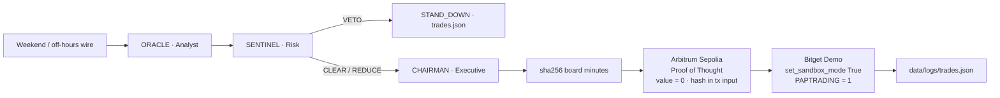

# CHRONOS-NEXUS

### Wall Street sleeps. The Nexus does not.

**Autonomous multi-agent weekend arbitrage for tokenized US equities (rTokens)**  
Bitget AI Base Camp Hackathon S2 · Track: **Agentic Trading** · Mode: **Paper / Demo only**

[](https://www.python.org/)
[-8E75B2?style=for-the-badge)](https://ai.google.dev/)
[](https://www.bitget.com/api-doc/classic/demotrading/restapi)
[](https://sepolia.arbiscan.io/)
[](#license)

Cash US equities close. Macro does not. Tokenized names (`rNVDA`, `rAAPL`, `rTSLA`, …) keep trading 24/7 on Bitget while NYSE / NASDAQ are dark. **Chronos-Nexus** is a three-agent “Board of Directors” that prices weekend and overnight information, stress-tests rumor quality, cryptographically anchors the decision on **Arbitrum Sepolia**, and dispatches a **Bitget Demo** paper order — with a local, append-only audit ledger.

The LLM is the decision-maker, not a chatbot. SENTINEL holds a binding veto. No live capital is reachable from this tree.

---

## Elevator pitch

Weekend geopolitics, supply-chain shocks, and tech-capex leaks hit the tape while cash equity is closed. Human desks wait for Sunday night futures and Monday’s cash open. rTokens already moved.

Chronos-Nexus runs that window as an **event → debate → risk clearance → on-chain Proof of Thought → paper execution** loop:

| Pain | What the Nexus does |
|---|---|
| Wall Street is closed; rTokens are not | ORACLE prices Monday gap risk on the 24/7 tape |
| Weekend “news” is often rumor | SENTINEL scores fake-news / black-swan and may **VETO** or **REDUCE** |
| Agentic trades are unauditable | CHAIRMAN hashes the board minutes and anchors `sha256` on Arbitrum Sepolia |
| Hackathon / evaluation risk | Bitget **Demo only** (`set_sandbox_mode(True)`, `PAPTRADING=1`) |

**Live E2E (this repo, 2026-09-10 UTC):** Gemini auto-resolved Flash · board debate completed · Sepolia attestation mined · Bitget Demo paper order `1481850718917124096` submitted on `NVDA/USDT:USDT`.

---

## Table of contents

1. [Autonomous multi-agent architecture](#autonomous-multi-agent-architecture-board-of-directors)
2. [Key features](#key-features--competitive-edge)
3. [Testnet / paper-trading compliance](#testnet--paper-trading-compliance)
4. [Production / mainnet migration](#production--mainnet-migration-guide)
5. [Quickstart](#quickstart--setup)
6. [Verifiable audit trail & on-chain proofs](#verifiable-audit-trail--on-chain-proofs)
7. [Repository map](#repository-map)
8. [License](#license)

---

## Autonomous multi-agent architecture (Board of Directors)

Three callsigns. One thesis. Python enforces the risk contract so the model cannot talk its way around a veto.

| Callsign | Agent | File | Mandate |
|---|---|---|---|
| **ORACLE** | Analyst | `agents/analyst.py` | Ingest the weekend / off-hours wire (geopolitics, supply-chain, tech-shift). Translate it into a **Monday cash-gap** thesis and a single rToken expression (`side`, `conviction`, `primary_symbol`). |
| **SENTINEL** | Risk Manager | `agents/risk_manager.py` | Stress-test rumor quality, black-swan flags, weekend rToken spread / gap-through risk, and concentration. Verdicts: **CLEAR** · **REDUCE** · **VETO**. Veto is binding. |
| **CHAIRMAN** | Executive | `agents/executive.py` | Synthesize the debate, lock the action, SHA-256 the board minutes, call `log_proof_of_thought()`, then `execute_paper_order()`. |

### Risk contract (non-negotiable)

| SENTINEL verdict | CHAIRMAN action | Size |
|---|---|---|
| `CLEAR` | `EXECUTE` | Full paper notional cap |
| `REDUCE` | `EXECUTE` | `max_notional_usdt × size_multiplier` |
| `VETO` | `STAND_DOWN` | Zero — Python overrides any model that tries to trade |

Demo venues often do not list the cash rToken (`rNVDA/USDT`). The executor maps the thesis onto a listed Demo proxy (verified: **`NVDA/USDT:USDT`** stock perp). That is a **venue constraint**, not a thesis change. SENTINEL is instructed not to veto solely because the rToken ticker is unlisted.

### Lifecycle



ASCII equivalent:

```
 Weekend Wire
      │
      ▼
 ┌─────────┐     ┌──────────┐     ┌───────────┐
 │ ORACLE  │────▶│ SENTINEL │────▶│ CHAIRMAN  │
 │ Analyst │     │ VETO /   │     │ Consensus │
 └─────────┘     │ REDUCE   │     └─────┬─────┘
                 └──────────┘           │
                        │               │
                     VETO               │ CLEAR / REDUCE
                        │               ▼
                        │        sha256(board minutes)
                        │               │
                        │               ▼
                        │        Arbitrum Sepolia
                        │        0-value self-tx
                        │        data = CHRONOS-NEXUS/v1:{hash}
                        │               │
                        │               ▼
                        │        Bitget Demo paper order
                        │        NVDA/USDT:USDT (proxy)
                        ▼               │
                   data/logs/trades.json ◀┘
```

Cortex and rails are not agents. They are infrastructure the board calls:

| Layer | Module | Role |
|---|---|---|
| Cortex | `core/config.py`, `core/llm.py` | `GEMINI_MODEL=auto` lists live `generateContent` models and binds the fastest stable **Flash** |
| Schemas | `core/schemas.py` | Pydantic contracts between agents and rails |
| Paper rail | `connectors/bitget_paper.py` | CCXT Bitget, sandbox first, Demo header, audit append |
| Attest rail | `connectors/arbitrum.py` | web3.py, chain ID **421614**, 0-value Proof of Thought |
| Command deck | `main.py` | High-contrast Rich UI — boot → ingest → debate → attest → execute |

---

## Key features & competitive edge

### 1. Dynamic auto-model resolver

`GEMINI_MODEL=auto` queries the live Gemini catalog (`google-genai`, with `google-generativeai` as fallback), keeps text `generateContent` models, drops image / live / TTS / embed, and scores **stable Flash over Pro, newest over oldest**.

Verified at boot: **40** chat-capable models discovered → resolved **`gemini-3.8-flash`**. Fallback chain (if a generation fails):

`gemini-3.8-flash → 3.7-flash → 3.6-flash → 3.5-flash → 2.5-flash → 2.5-flash-lite → 1.5-flash → 1.5-pro`

No hardcoded stale ID. No paid “router” service. Pin a model by setting `GEMINI_MODEL=gemini-1.5-flash` (or any listed id).

### 2. Cryptographic Proof of Thought

Before the paper order is sent, CHAIRMAN canonicalizes the board minutes (ORACLE + SENTINEL + action/size/symbol) and SHA-256s them. `connectors/arbitrum.py` submits a **zero-value self-transaction** on Arbitrum Sepolia whose `input` data is:

```text
CHRONOS-NEXUS/v1:{64-char sha256}
```

Anyone can recompute the hash from `trades.json` and match it to the tx calldata on [Sepolia Arbiscan](https://sepolia.arbiscan.io/). Insufficient gas is a skipped attestation, not a crash — the paper ledger still writes.

### 3. Circuit breakers

- **Binding veto** — Python, not prompt, forces `STAND_DOWN` on `VETO`
- **Fake-news score** — `LOW | MEDIUM | HIGH` on weekend-leak quality
- **Black-swan flags** — war-risk, halt, rToken air-pocket, Monday gap-reversal
- **Size clamp** — paper notional capped (default 15 USDT, hard ceiling 50)
- **Live-trading deadman** — `LIVE_TRADING_ENABLED = False` in `main.py`; Bitget connector refuses `BITGET_PAPER_TRADING=false`

### 4. Matrix command deck

`main.py` is a terminal-native CIC: ASCII banner, compliance lock, real Gemini / Bitget / Sepolia health, weekend-wire table, dual-panel ORACLE vs SENTINEL debate, CHAIRMAN decision, attestation explorer URL, paper-order panel. Built with [Rich](https://github.com/Textualize/rich). Use **Windows Terminal** (or any UTF-8 truecolor host).

---

## Testnet / paper-trading compliance

This repository is built for **Bitget AI Base Camp Hackathon S2** evaluation. It will not spend real funds.

| Surface | Lock | How it is enforced |
|---|---|---|
| Bitget | Demo / paper only | `BITGET_PAPER_TRADING=true` required. `ccxt.bitget(...); exchange.set_sandbox_mode(True)` is the **first** call after construct. Header `PAPTRADING: 1`. |
| Bitget keys | Demo API key | Create under **Bitget → Demo mode → API Key Management**. Live keys are the wrong environment. |
| Arbitrum | Sepolia, chain ID **421614** | RPC default `https://sepolia-rollup.arbitrum.io/rpc`. `eth_chainId` is checked; mismatch aborts attest. |
| Value transfer | None | Proof-of-Thought `value = 0`, `to = from` (self-tx). Payload is calldata only. |
| Process flag | Deadman | `LIVE_TRADING_ENABLED = False` — boot returns `2` if flipped on without a deliberate code change. |

```python
# connectors/bitget_paper.py — sandbox is not optional
exchange = ccxt.bitget({..., "headers": {"PAPTRADING": "1"}})
exchange.set_sandbox_mode(True)  # first call after construct
```

```python
# core/config.py
def assert_paper_trading(self) -> None:
    # REFUSING TO BOOT unless BITGET_PAPER_TRADING is true
```

Evaluators: claim **Bitget Demo virtual USDT** before a fill is possible. An unfunded Demo wallet records `INSUFFICIENT_MARGIN` in `trades.json` rather than failing closed-loop silently.

---

## Production / mainnet migration guide

**This tree ships with the hackathon deadman on.** Flipping one env var is **not** enough while those gates remain. That is intentional. Forks that want mainnet should treat the lift as a conscious, reviewed change — not a hidden default.

### What does *not* change

Agent prompts, risk contract, hashing, Rich lifecycle, and the Executive sequence (`synthesize → attest → execute`) stay the same. You are swapping **rails and keys**, not rewriting the board.

### 1. Environment

```dotenv
# Bitget live (replace Demo API key with a live key — never commit it)
BITGET_PAPER_TRADING=false
BITGET_API_KEY=                         # live key
BITGET_API_SECRET=
BITGET_PASSPHRASE=
BITGET_SYMBOL=rNVDA/USDT                # live rToken spot, if listed

# Arbitrum One (chain ID 42161) — not Sepolia 421614
ARBITRUM_SEPOLIA_RPC=https://arb1.arbitrum.io/rpc
ARBITRUM_SEPOLIA_CHAIN_ID=42161
ARBITRUM_PRIVATE_KEY=                   # mainnet key; 0-value attest still recommended
```

`ARBITRUM_SEPOLIA_*` names are historical; they currently carry whatever RPC / chain ID you set. Point them at One when you migrate.

### 2. Code gates you must lift (explicit)

| Gate | File | Today | Mainnet fork |
|---|---|---|---|
| Boot deadman | `main.py` | `LIVE_TRADING_ENABLED = False` | Set `True` only after review |
| Settings assert | `core/config.py` → `assert_paper_trading()` | Refuses `BITGET_PAPER_TRADING=false` | Allow false / split Demo vs live factory |
| Connector refuse | `connectors/bitget_paper.py` | `if not settings.bitget_paper_trading: raise` | Construct **without** `set_sandbox_mode(True)` and **without** `PAPTRADING=1` |
| Chain allow-list | `connectors/arbitrum.py` | Expects `421614` | Expect `42161` (Arbitrum One) |
| Explorer | `EXPLORER_TX` | `sepolia.arbiscan.io` | `arbiscan.io` |

After those gates are lifted, CHAIRMAN still: hash → 0-value attest → `create_order`. No second execution path.

### 3. Operational checklist (do not skip)

1. Use a **dedicated sub-account** with a hard loss cap. Prefer Bitget Agentic / Demo until the paper Sharpe is boring.
2. Size is still SENTINEL-capped; raise `paper_notional_usdt` only with a written policy.
3. Confirm the live symbol (`rNVDA/USDT` vs `NVDA/USDT:USDT`) with `load_markets()` — Demo listings ≠ production listings.
4. Fund the attester with a dust amount of ETH on **Arbitrum One** (still `value = 0`).
5. Keep `data/logs/trades.json` and the explorer URL as the dual ledger.

If you are evaluating this hackathon entry, **do not migrate**. Run Demo + Sepolia as shipped.

---

## Quickstart & setup

### Prerequisites

- Python **3.10+** (verified on 3.12)
- Git
- A [Gemini API key](https://aistudio.google.com/apikey)
- Bitget **Demo** API key + secret + passphrase  
  Path: Bitget → **Demo trading** → API Key Management
- An Arbitrum **Sepolia** account with a small ETH balance (faucet) for 0-value txs
- Virtual Demo USDT claimed on Bitget Demo (required for a fill)

### Step 1 — Clone

```bash
git clone https://github.com/YOUR_ORG/Chronos-Nexus.git
cd Chronos-Nexus
```

Windows PowerShell:

```powershell
git clone https://github.com/YOUR_ORG/Chronos-Nexus.git
cd Chronos-Nexus
```

### Step 2 — Virtualenv & dependencies

```bash
python -m venv .venv
# Windows:
.\.venv\Scripts\Activate.ps1
# macOS / Linux:
# source .venv/bin/activate

python -m pip install --upgrade pip
pip install -r requirements.txt
```

If PowerShell blocks activation:

```powershell
Set-ExecutionPolicy -Scope Process -ExecutionPolicy Bypass
.\.venv\Scripts\Activate.ps1
```

### Step 3 — Configure `.env`

```powershell
copy .env.example .env
```

```bash
cp .env.example .env
```

Fill values (never commit `.env`):

```dotenv
# --- LLM (GEMINI_MODEL=auto resolves the fastest stable Flash) ---
GEMINI_API_KEY=your_gemini_key
GEMINI_MODEL=auto

# --- Bitget Paper Trading (Demo API key — NOT a live key) ---
BITGET_API_KEY=your_demo_api_key
BITGET_API_SECRET=your_demo_secret
BITGET_PASSPHRASE=your_demo_passphrase
BITGET_PAPER_TRADING=true
BITGET_SYMBOL=rNVDA/USDT

# --- Arbitrum Sepolia (chain ID 421614) ---
ARBITRUM_SEPOLIA_RPC=https://sepolia-rollup.arbitrum.io/rpc
ARBITRUM_SEPOLIA_CHAIN_ID=421614
ARBITRUM_PRIVATE_KEY=0xyour_sepolia_private_key
```

### Step 4 — Run the board

```bash
python main.py
```

Expected phases:

1. Kernel / compliance lock  
2. Gemini cortex (auto-select)  
3. Bitget Demo + Arbitrum Sepolia health  
4. Weekend macro ingest  
5. ORACLE vs SENTINEL debate  
6. CHAIRMAN — Proof of Thought + paper order  

Press Enter to shut down. Full minutes land in `data/logs/trades.json`.

---

## Verifiable audit trail & on-chain proofs

### Local ledger

Every motion — `EXECUTE`, `VETOED`, `INSUFFICIENT_MARGIN`, or venue `ERROR` — is appended to:

```text
data/logs/trades.json
```

Each record carries: ISO timestamp, `sandbox: true`, `live_trading: false`, symbol / side / amount, `reasoning_hash`, ORACLE brief, SENTINEL report, CHAIRMAN decision, attestation blob, and the Bitget order id when the Demo API accepts the ticket.

### Hash schema

```text
reasoning_hash = sha256( json.dumps({
    analyst, risk, action, symbol, side, amount, notional_usdt, reasoning
}, sort_keys=True, separators=(',', ':')) )
```

On-chain `input` (hex-decoded ASCII):

```text
CHRONOS-NEXUS/v1:{reasoning_hash}
```

### Verified Sepolia attestations (this repo)

| UTC | `reasoning_hash` | Tx | Result |
|---|---|---|---|
| 2026-09-10 07:30 | `0b36683f…e1306cc7` | [`0x1b3ecc83…556fe721`](https://sepolia.arbiscan.io/tx/0x1b3ecc83c316e46dc7b18edb3b86da96c04a57d8af6eb68765542b96556fe721) | Anchored (`value = 0`, chain **421614**) |
| 2026-09-10 07:51 | `a51fd447…d2cda5b6` | [`0xacf4e0ea…fde73b24`](https://sepolia.arbiscan.io/tx/0xacf4e0ea402cc66e03984e307c349094be088acc7b499e6eb0a381aefde73b24) | Anchored, then **Bitget Demo order `1481850718917124096`** on `NVDA/USDT:USDT` |

Attester (Sepolia): [`0x9AFe5CeF11fC10756faef213f7A30D9873B5d372`](https://sepolia.arbiscan.io/address/0x9AFe5CeF11fC10756faef213f7A30D9873B5d372)

Recompute from the matching object in `trades.json` and compare to the tx input on Arbiscan. That is the sponsor-visible on-chain validation path.

### Example paper ticket (sanitized)

```json
{
  "venue": "bitget-demo",
  "sandbox": true,
  "live_trading": false,
  "symbol": "NVDA/USDT:USDT",
  "side": "buy",
  "status": "submitted",
  "order_id": "1481850718917124096",
  "reasoning_hash": "a51fd447b0df32db758ad6642a1f7923117aec31b0fab872e0872113d2cda5b6",
  "attestation": {
    "ok": true,
    "tx_hash": "0xacf4e0ea402cc66e03984e307c349094be088acc7b499e6eb0a381aefde73b24",
    "chain_id": 421614,
    "reason": "anchored"
  }
}
```

---

## Repository map

```text
Chronos-Nexus/
├── main.py                      # Rich CIC + demo lifecycle
├── requirements.txt
├── .env.example                 # copy to .env — never commit secrets
├── agents/
│   ├── analyst.py               # ORACLE
│   ├── risk_manager.py          # SENTINEL
│   └── executive.py             # CHAIRMAN
├── core/
│   ├── config.py                # dotenv, paper lock, Gemini auto-select
│   ├── llm.py                   # Gemini cortex
│   └── schemas.py               # Pydantic board contracts
├── connectors/
│   ├── bitget_paper.py          # Demo / PAPTRADING=1 + trades.json
│   └── arbitrum.py              # Sepolia Proof of Thought
├── data/logs/trades.json        # append-only paper ledger
├── contracts/                   # reserved for a future attest contract
└── tests/
```

---

## Disclaimer

Chronos-Nexus is research / hackathon software. Weekend wires in the default demo are **desk scenarios** for the event→decision→execution path, not a live news warranty. Tokenized equity products and Demo listings differ by region and account. Nothing here is investment advice. Do not point this process at live keys unless you have lifted the documented gates and accept the loss.

---

## License

MIT. Use, fork, and modify with attribution. Keep Demo keys and mainnet keys out of git.

---

**CHRONOS-NEXUS** — *Bitget AI Base Camp Hackathon S2 · Agentic Trading*  
ORACLE · SENTINEL · CHAIRMAN
