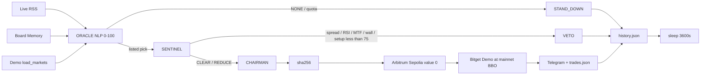

# CHRONOS-NEXUS

```text
 ██████╗██╗  ██╗██████╗  ██████╗ ███╗   ██╗ ██████╗ ███████╗
██╔════╝██║  ██║██╔══██╗██╔═══██╗████╗  ██║██╔═══██╗██╔════╝
██║     ███████║██████╔╝██║   ██║██╔██╗ ██║██║   ██║███████╗
██║     ██╔══██║██╔══██╗██║   ██║██║╚██╗██║██║   ██║╚════██║
╚██████╗██║  ██║██║  ██║╚██████╔╝██║ ╚████║╚██████╔╝███████╗
 ╚═════╝╚═╝  ╚═╝╚═╝  ╚═╝ ╚═════╝  ╚═╝  ╚═══╝ ╚══════╝ ╚══════╝
███╗   ██╗███████╗██╗  ██╗██╗   ██╗███████╗
████╗  ██║██╔════╝╚██╗██╔╝██║   ██║██╔════╝
██╔██╗ ██║█████╗   ╚███╔╝ ██║   ██║███████╗
██║╚██╗██║██╔══╝   ██╔██╗ ██║   ██║╚════██║
██║ ╚████║███████╗██╔╝ ██╗╚██████╔╝███████║
╚═╝  ╚═══╝╚══════╝╚═╝  ╚═╝ ╚═════╝ ╚══════╝
```

### Wall Street sleeps. The Nexus does not.

**Event-Driven Agent** for news-driven directional trading on tokenized US equities (rTokens / stock perps).

Bitget AI Base Camp Hackathon S2 · Track: **Agentic Trading** · Sub-theme: **Event-Driven Agent** · Mode: **Paper / Demo only** · Version: **1.3.0-desk**

[](https://www.python.org/)
[](https://bitget-ai.gitbook.io/bitgetai_hackathons2)
[](https://www.bitget.com/api-doc/classic/demotrading/restapi)
[](#ai-brain)
[](https://sepolia.arbiscan.io/)
[](#telegram-desk--how-judges-test)
[](#license)

The LLM is the decision-maker, not a chatbot. SENTINEL holds a binding veto. Private orders never leave Bitget Demo. Live last/bid/ask/mark/L2/OHLCV come from a **keyless mainnet** Bitget feed so paper fills peg to the real book. **Zero dummy tape. Zero hardcoded five-name book. Zero assumed BUY.**

---

## Hackathon identity

| Field | Value |
|---|---|
| **Track** | Agentic Trading |
| **Sub-theme** | Event-Driven Agent |
| **What we built** | Live news → Qwen board debate → Python risk rails → Demo paper order |
| **What we did not build** | rToken vs NAV mint/redeem spread capture |
| **Validation** | Bitget Demo (`PAPTRADING=1`) during the S2 window |
| **Scoring mix** | 50% quantitative + 50% judge (explainability, architecture, risk) |
| **Handbook** | [Developer Handbook](https://bitget-ai.gitbook.io/bitgetai_hackathons2) · [Landing](https://www.bitget.com/en/activity-hub/hackathon) |

GitBook: *“The LLM is the primary trading decision-maker, not just an assistant. The Agent must sense the environment, make independent judgments, and autonomously place orders with risk controls.”*

---

## Hybrid execution (manual Spot + AI futures)

Two order routes. Both are real Bitget Demo calls. Neither uses a local balance.

| Who | Market | CCXT route | What it does |
|---|---|---|---|
| **Operator Telegram** | Demo **Spot** | `type=spot` | `BUY 1000 USDT BTC`, `NVDA/USDT BUY $10`, `/buy NVDA 10`. Spends the spot USDT wallet. No leverage, no SL/TP. |
| **ORACLE → SENTINEL → CHAIRMAN** | Demo **USDT-M perpetuals** and allowed stock/rToken contracts | `type=swap`, `productType=USDT-FUTURES` | Hourly cycle only. Cash symbols such as `BTC/USDT` are refused. Crypto perps such as `BTC/USDT:USDT` stay off the board. |
| **Perception** | Keyless **mainnet** `spot` + `swap` | public | Live last, bid, ask, markPrice, L2, OHLCV. Marks and PnL use this tape, not a sandbox print. |

`/balance` prints the spot ledger and the futures ledger on separate lines. They are not added together. `/positions` lists the USDT-M book (entry, live mark, real PnL) and spot holdings (qty and live last; no invented entry). `/close SYMBOL` reduces a futures position or market-sells a spot holding. `/closeall` flattens both.

AI protective orders are attached on the swap fill: stop is 50–100% of invested margin, first take-profit at +25% PnL, then a trail. Unrealized PnL is `(mark − entry) × qty` from the exchange entry and the live mainnet mark. A missing entry prints `n/a`, not 0%.

## Hybrid pricing (mainnet BBO + Demo fill)

Paper trading is worthless if the fill is a sandbox mid. Private orders stay on Demo:

| Rail | Client | What it does |
|---|---|---|
| **Execution** | Authenticated CCXT Bitget **sandbox** | `set_sandbox_mode(True)` first. Header `PAPTRADING: 1`. Swap opens, SL/TP, closes, and operator Spot fills. |
| **Perception** | Keyless CCXT Bitget **mainnet** (`spot` + `swap`) | Live last, bid, ask, markPrice, L2, OHLCV. Never a sandbox print. |

**Fill peg (never a mid):**

- BUY / cover lifts the **best ask**
- SELL / close hits the **best bid**
- Swap / rToken entries refuse if BBO vs `markPrice` exceeds **2%**
- Spot names without mark (e.g. BGB) still peg last/bid/ask

Logs stamp `price_source=mainnet_bbo`. Closes keep the original entry.

BGB fee optimization: `options.deduct=on`. Boot calls UTA `v3/account/switch-deduct`, then classic `v2/spot/account/switch-deduct`. Fail-open. Deduct is **never** put on `create_order` bodies (Bitget rejects unknown order params).

---

## AI brain

Three agents. Python rails bind the model. A trade needs **multi-timeframe candles + volume + order book + 24h range** to clear a **75% TA setup score**. News is context. The desk is an active day trader.

```
 LIVE RSS (Yahoo / CNBC / MarketWatch / CoinTelegraph)
      │
      ▼
 ORACLE  ·  0–100 source-weighted sentiment + conviction
      │
      ├─ idle / timeout / 429 quota ──► STAND_DOWN
      │
      ▼ pick (unoccupied Demo universe only)
 SENTINEL  ·  15m entry · 1h confirm · 4h regime
           ·  L2 walls · rvol / volume profile · VWAP pullback
           ·  setup ensemble ≥ 75 or VETO
      │
      ├─ VETO / daily halt / occupied book ──► Telegram + trades.json
      │
      ▼ CLEAR / REDUCE
 CHAIRMAN  ·  sha256(board minutes) · Arbitrum Sepolia (value = 0)
      │
      ▼
 Bitget Demo  ·  mainnet BBO peg  ·  margin SL  ·  +25% scaled TP
      │
      ▼
 Telegram  ·  /pnl /status /price /balance  ·  operator Spot + AI futures
 sleep 3600s
```

### 1. ORACLE — news NLP (0–100)

Not a bull/bear flag. Each headline starts at **neutral 50**. Lexicon hits move the score; source credibility and recency shrink the move back toward 50:

```text
sentiment = clip(50 + (raw − 50) × credibility × recency, 0, 100)
```

| Input | Model |
|---|---|
| Source weight | CNBC/Bloomberg 1.00 · Reuters 0.98 · WSJ 0.96 · FT 0.95 · Yahoo 0.88 · MarketWatch 0.82 · CoinTelegraph 0.52 |
| Recency | ≤3h = 1.00 · ≤12h = 0.90 · ≤24h = 0.75 · ≤48h = 0.50 · older = 0.25 |
| Macro / high impact | Fed, FOMC, CPI, NFP, earnings, guidance, SEC, FDA — 1.25× weight |
| Conflict | Bulls ≈ bears on the focused tape → conflict flag, conviction capped at 20 |
| Conviction | `clip(50 + 0.9 × 100 × \|s−50\|/50 × cred × recency × impact_w, 0, 100)` |

Qwen still writes the thesis. Python **clips** model conviction to the NLP score so a 90-conviction BUY cannot ride a 51 tape. Conflicted or ~50 wire → `NONE` / `STAND_DOWN`. Never a default NVDA.

### 2. SENTINEL — multi-timeframe + book + volume

| Layer | Rule |
|---|---|
| **15m** | Entry. Wilder RSI(14). BUY veto RSI ≥ 70. SELL veto RSI ≤ 30. Unmeasured RSI is fail-open. |
| **1h** | Confirmation. Structure + SMA(20) slope. |
| **4h** | Regime. Must agree with 1h for `ALIGNED`. Disagreement is `CONFLICT` → hard VETO. |
| **L2 imbalance** | `(bid_vol − ask_vol) / total` on CCXT `fetch_order_book`. BUY blocked on a sell wall (size ≥ 3× median within 0.8% of last) or imbalance ≤ −0.35. |
| **Volume profile** | 20-bin POC + 70% value area. A break outside VA on rvol < 1.1 is a **fakeout** VETO. |
| **VWAP** | Typical price × volume. ALIGNED tape with \|close−VWAP\| > 1.2% waits for pullback (`VETO: Price extended`). |

Candle structure BREAK against the news side is a hard VETO (`VETO: Candle structure contradicts news thesis`).

### 3. Setup ensemble — 75% TA gate (active day trader)

When 1h and 4h are measured:

```text
score = 0.10·news + 0.22·HTF + 0.18·entry + 0.18·volume
      + 0.16·book + 0.10·extension + 0.06·conviction
```

**If `score < 75` → `VETO: Setup confidence below 75 — wait for a cleaner TA tape`.**

The 75% rail requires a live 1h/4h tape from Bitget OHLCV (the hourly daemon always fetches it). Unmeasured HTF does not invent a 50 and kill the trade — same fail-open as unmeasured RSI — so daily limits, RSI, spread, BBO, and the Telegram desk stay intact.

---

## Risk contract (non-negotiable)

| Condition | Action | Size |
|---|---|---|
| Setup ≥ 75 and SENTINEL `CLEAR` | `EXECUTE` | Sized inside 6% daily equity cap |
| SENTINEL `REDUCE` | `EXECUTE` | `max_notional_usdt × size_multiplier` |
| SENTINEL `VETO` / setup < 75 / HTF conflict / wall / fakeout | `STAND_DOWN` | Zero — Python overrides the model |
| ORACLE idle (`NONE` / conviction 0) | `STAND_DOWN` | Zero |
| Qwen timeout / 503 / 429 quota | `STAND_DOWN` | Zero — daemon stays up |
| Occupied symbol | skip new entry | Anti-stack |
| UTC day: 4 entries **or** 3 wins **or** any SL **or** chop/downtrend | hard stand-down | Zero new entries |
| Spread > 1.5% or dark/crossed book | `Illiquid Market / High Spread` | Zero |

**Protective geometry (live book, not a flat 2%/5% toy):**

- Stop = **50–100% of invested margin** from asset-risk score (high risk → tighter)
- First take-profit at **+25% PnL**, scale 50%, trail the runner
- Max **4** UTC-day entries; deployed margin ≤ **6%** of live `fetch_balance` equity

---

## Telegram desk — how judges test

The native Menu is registered with `setMyCommands`. `TELEGRAM_CHAT_ID` is the operator. Every other chat gets a reply. Nothing is dropped silently.

**Guests.** `/start` and `/menu` greet the sender by Telegram name, print their user id, and state that access is read-only. They can use `/help`, `/price`, `/status`, and `/positions`. A trade, close, `/balance`, or `/pnl` replies exactly `Access Denied: Operator command only.`

**Operator.**

| Command | What you should see |
|---|---|
| `/menu` or `/dashboard` | Headless terminal. **Live Market Status** = `/status`. **My Real PnL** = `/pnl`. **Open Positions** = `/positions`. **Force Close All** confirms, then flattens futures and spot. |
| `/price BGB` or `/price BGB/USDT` | Live **mainnet** last, 24h high, 24h low, 24h quote volume, and market cap or visible book notional |
| `/balance` | Spot USDT and futures USDT, each with free / used / total. Not summed. |
| `/balance NVDA` | That coin on both ledgers, or `0.00 NVDA found in wallet.` if both are empty |
| `/pnl` | Today’s realized PnL from the daily ledger, real W/L, `Trades left: X`, halt, plus unrealized from the live futures book |
| `/status` | Live ORACLE sentiment, conviction, desk `ARMED` or `STAND_DOWN`, SENTINEL verdict. No scan → `NO SCAN YET` |
| `/positions` | Futures rows with entry, live mark, and PnL. Spot rows with qty, live last, and market value |
| `/close SYMBOL` | Reduce-only close if it is a futures position; otherwise a spot market sell |
| `/closeall` | Flatten the USDT-M book and sell spot holdings above the 1 USDT minimum |
| `BUY 1000 USDT BTC` | Immediate Demo **Spot** market buy. Receipt shows the spot USDT balance before and after |
| `NVDA/USDT BUY $10` or `/buy NVDA 10` | Same Spot route. A bare `/buy` without a size is refused |

The AI hourly cycle does not see these Spot tickets. `/pnl` and `/status` read `data/history.json` and the live Bitget book. They do not invent numbers.

---

## Part 3 metrics (GitBook)

Agentic Trading is scored **50% quantitative + 50% judge**. Figures below are labeled. Nothing is invented.

| Metric | Value | Label |
|---|---|---|
| **Test period** | S2 window **2026-09-03 → 2026-09-27 (UTC+8)**. Paper log started **2026-09-10**. Handbook asks ≥ 2 weeks. | observed window / targeted ≥2 weeks |
| **Returns** | From live `data/logs/trades.json` | observed |
| **Sharpe / Sortino** | Hourly equity returns, 24×365 bars | observed |
| **Max drawdown** | Peak-to-trough on Demo USDT path | observed |
| **Win rate** | Closed tickets with `account_balance_change > 0` ÷ closed tickets. Vetoes are not wins. | observed |
| **Turnover** | `Σ \|notional_usdt\|` ÷ average Demo equity | observed |
| **Fees** | USDT-M taker **6 bps**; BGB deduct armed when the account switch succeeds | estimated / observed |
| **Slippage** | L2 captured per cycle; **spread > 1.5% is a VETO**, not a cost. Fill vs BBO peg in the log. | observed |
| **Funding** | Stock-perp funding on Demo when a position spans a funding stamp | observed / n/a |

How numbers are computed: `Σ account_balance_change` on fills, plus mark-to-market on open stock perps when logged. Open `trades.json` for the raw path.

---

## Agent architecture

| Callsign | Role | File | Mandate |
|---|---|---|---|
| **ORACLE** | Analyst | `agents/analyst.py` | Live RSS + session clock + NLP sentiment. Pick one listed Demo name or `NONE`. |
| **SENTINEL** | Risk | `agents/risk_manager.py` | Binding veto. Spread, RSI, MTF, walls, volume, 75% TA setup, daily limits. |
| **CHAIRMAN** | Executive | `agents/executive.py` | Lock action, hash minutes, Sepolia attest, Demo execute or `STAND_DOWN`. |

1. **Event** — live Yahoo / CNBC / MarketWatch / CoinTelegraph RSS + UTC session clock.
2. **Decision** — ORACLE brief → SENTINEL CLEAR / REDUCE / VETO → CHAIRMAN `EXECUTE` or `STAND_DOWN`. Python overrides the model on veto, idle, timeout, and 429.
3. **Execution** — zero-value Arbitrum Sepolia attestation of `sha256(board minutes)`, then Bitget Demo market order at **mainnet BBO**, GitBook columns in `trades.json`.



---

## Compliance audit (S2 handbook)

Audited against [Bitget AI Hackathon S2 Developer Handbook](https://bitget-ai.gitbook.io/bitgetai_hackathons2) and the [landing page](https://www.bitget.com/en/activity-hub/hackathon). **No rule required a feature to be disabled.**

| Rule | Status | Evidence |
|---|---|---|
| Paper / Demo only | **PASS** | `BITGET_PAPER_TRADING=true` required. `set_sandbox_mode(True)` is the first call after construct. Header `PAPTRADING: 1`. `LIVE_TRADING_ENABLED = False` deadman. |
| LLM is the decision-maker | **PASS** | ORACLE / SENTINEL / CHAIRMAN call Qwen; Python rails bind vetoes. |
| Event → decision → execution | **PASS** | RSS → board → Sepolia hash → Demo order. |
| Official Qwen path | **PASS** | `openai` SDK → `https://hackathon.bitgetops.com/v1` · model `qwen3.8-max`. Direct DashScope is not used. 90s timeout, 8192 max tokens. 429 quota stand-down string is exact. |
| Allowed libraries | **PASS** | `openai`, `ccxt`, `web3`, `pydantic`, `requests`, `feedparser`, `rich`, `pillow`. No restricted stack. |
| GitBook paper log | **PASS** | Every row: `timestamp`, `instrument`, `direction`, `quantity`, `price` (never null), `account_balance_change`. |
| On-chain proof | **PASS** | Arbitrum Sepolia chain **421614**, `value = 0`, calldata `CHRONOS-NEXUS/v1:{sha256}`. |
| Runnable Demo + ≥2-week paper log | **PASS** | `python main.py` hourly daemon. Log started 2026-09-10. |
| Hybrid mainnet BBO | **PASS** | Public (keyless) market data only. Orders stay on Demo. |
| Manual Spot vs AI futures | **PASS** | Operator chat executes Demo Spot (`type=spot`). The hourly cycle executes USDT-M only (`type=swap`). Guests are read-only. |
| Daily limits + scaled TP + anti-stack | **PASS** | Unchanged by the 75% TA brain. HTF-unmeasured fixtures no longer false-veto those rails. |

What the running desk actually does:

- The hourly cycle places Demo USDT-M orders only, with a live-mark SL/TP and a chunked reduce-only close when Bitget returns `45113`.
- The operator Telegram chat can place a Demo Spot market order. Guests can read `/help`, `/price`, `/status`, and `/positions`.
- Balances, positions, and fills come from Bitget. A failed wallet read is reported as a failure or as zero change, not a simulated balance.

---

## Quickstart

### Prerequisites

- Python **3.10+** (verified on 3.12)
- Bitget hackathon `QWEN_API_KEY`
- Bitget **Demo** API key + secret + passphrase
- Arbitrum **Sepolia** account with a little ETH (0-value txs)
- Virtual Demo USDT claimed on Bitget Demo
- Optional: Telegram bot token + chat id

### Install

```bash
git clone https://github.com/Jubayir-hub-69/Chronos-Nexus.git
cd Chronos-Nexus
python -m venv .venv
# Windows: .\.venv\Scripts\Activate.ps1
# macOS / Linux: source .venv/bin/activate
python -m pip install --upgrade pip
pip install -r requirements.txt
cp .env.example .env
```

### `.env`

```dotenv
QWEN_API_KEY=your_bitget_qwen_api_key
QWEN_MODEL=qwen3.8-max

BITGET_API_KEY=your_demo_api_key
BITGET_API_SECRET=your_demo_secret
BITGET_PASSPHRASE=your_demo_passphrase
BITGET_PAPER_TRADING=true
BITGET_SYMBOL=rNVDA/USDT:USDT

ARBITRUM_SEPOLIA_RPC=https://sepolia-rollup.arbitrum.io/rpc
ARBITRUM_SEPOLIA_CHAIN_ID=421614
ARBITRUM_PRIVATE_KEY=0xyour_sepolia_private_key

TELEGRAM_BOT_TOKEN=123456:ABC-your-bot-token
TELEGRAM_CHAT_ID=your_numeric_chat_id
```

### Run

```bash
python main.py
```

Boot: compliance lock → Qwen cortex (90s / 8192 tokens) → Bitget Demo + Sepolia health → live universe count → Telegram menu registration. Then hourly: RSS → ORACLE → SENTINEL → CHAIRMAN. Stop with **Ctrl+C**. Cycle faults sleep 5 minutes and recover.

```bash
python -m unittest discover -s tests -v
```

---

## Audit trail

| Column | JSON key | Source |
|---|---|---|
| timestamp | `timestamp` | UTC ISO-8601 |
| instrument | `instrument` | Demo market id |
| direction | `direction` | `buy` / `sell` / `none` |
| quantity | `quantity` | sized contracts / base |
| price | `price` (never null) | mainnet BBO peg, else live last, else `0.0` on stand-down |
| account balance change | `account_balance_change` | Live wallet after − before on the ledger that filled (spot or futures). `0.0` when the read fails or the row is a veto. |

| File | Role |
|---|---|
| `data/logs/trades.json` | Append-only paper ledger |
| `data/history.json` | Last 5 cycles + UTC daily ledger + live ORACLE/SENTINEL snapshot |
| `data/desk.json` | Open-book metadata (SL/TP, thesis, trail) |

Verified Sepolia attestations:

| UTC | Tx |
|---|---|
| 2026-09-10 07:30 | [`0x1b3ecc83…556fe721`](https://sepolia.arbiscan.io/tx/0x1b3ecc83c316e46dc7b18edb3b86da96c04a57d8af6eb68765542b96556fe721) |
| 2026-09-10 07:51 | [`0xacf4e0ea…fde73b24`](https://sepolia.arbiscan.io/tx/0xacf4e0ea402cc66e03984e307c349094be088acc7b499e6eb0a381aefde73b24) then Demo order `1481850718917124096` on `NVDA/USDT:USDT` |

Attester: [`0x9AFe5CeF11fC10756faef213f7A30D9873B5d372`](https://sepolia.arbiscan.io/address/0x9AFe5CeF11fC10756faef213f7A30D9873B5d372)

---

## Production / mainnet

This tree ships with the hackathon deadman **on**. Flipping one env var is not enough.

| Gate | Today |
|---|---|
| `LIVE_TRADING_ENABLED` | `False` — boot returns 2 if flipped |
| `BITGET_PAPER_TRADING` | Must be true |
| Connector | Sandbox + `PAPTRADING: 1` |
| Chain | `421614` Sepolia |

Evaluators: run Demo + Sepolia as shipped.

---

## Repository map

```text
Chronos-Nexus/
├── main.py                      # Rich CIC · hourly Event-Driven Agent (v1.3.0-desk)
├── requirements.txt
├── agents/
│   ├── analyst.py               # ORACLE — RSS, NLP 0–100, NONE stand-down
│   ├── risk_manager.py          # SENTINEL — 75% TA setup, MTF, walls, daily limits
│   └── executive.py             # CHAIRMAN — hash, attest, execute
├── core/
│   ├── news.py                  # Source-weighted sentiment + conviction
│   ├── ta.py                    # RSI, MTF, VWAP, volume profile, setup ensemble
│   ├── llm.py                   # hackathon.bitgetops.com/v1 · 90s · 8192 tokens · 429/503
│   ├── memory.py                # history.json + daily PnL + engine snapshot
│   ├── positions.py             # Trail, +25% partial, thesis close
│   └── schemas.py
├── connectors/
│   ├── bitget_paper.py          # Spot + USDT-M execute · mainnet marks · BGB deduct
│   └── arbitrum.py              # Sepolia Proof of Thought
├── utils/
│   ├── commands.py              # Guest/admin desk, hybrid /balance /positions /close
│   ├── spot_chat.py             # Operator Spot command parser
│   ├── notifier.py
│   └── pnl_card.py
├── data/
│   ├── history.json
│   ├── desk.json
│   └── logs/trades.json
└── tests/                       # phase1 through phase13_futures_access
```

---

## Disclaimer

Chronos-Nexus is research / hackathon software. The wire is live RSS, not a licensed terminal. Tokenized equity products differ by region. Protective orders depend on Bitget Demo order types. Qwen quota is a platform limit — the desk stands down until reset. Nothing here is investment advice. Do not point this process at live keys unless you have lifted the documented gates.

---

## License

MIT. Use, fork, and modify with attribution. Keep Demo keys, Telegram tokens, and mainnet keys out of git.

---

**CHRONOS-NEXUS** — *Bitget AI Base Camp Hackathon S2 · Agentic Trading · Event-Driven Agent*  
ORACLE · SENTINEL · CHAIRMAN  
**Manual Spot. AI USDT-M futures. Mainnet marks. Guest read-only. Paper only.**
