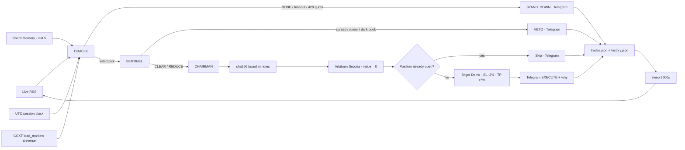

# CHRONOS-NEXUS

```text
 ██████╗██╗  ██╗██████╗  ██████╗ ███╗   ██╗ ██████╗ ███████╗
██╔════╝██║  ██║██╔══██╗██╔═══██╗████╗  ██║██╔═══██╗██╔════╝
██║     ███████║██████╔╝██║   ██║██╔██╗ ██║██║   ██║███████╗
██║     ██╔══██║██╔══██╗██║   ██║██║╚██╗██║██║   ██║╚════██║
╚██████╗██║  ██║██║  ██║╚██████╔╝██║ ╚████║╚██████╔╝███████║
 ╚═════╝╚═╝  ╚═╝╚═╝  ╚═╝ ╚═════╝ ╚═╝  ╚═══╝ ╚══════╝ ╚══════╝
███╗   ██╗███████╗██╗  ██╗██╗   ██╗███████╗
████╗  ██║██╔════╝╚██╗██╔╝██║   ██║██╔════╝
██╔██╗ ██║█████╗   ╚███╔╝ ██║   ██║███████╗
██║╚██╗██║██╔══╝   ██╔██╗ ██║   ██║╚════██║
██║ ╚████║███████╗██╔╝ ██╗╚██████╔╝███████╗
╚═╝  ╚═══╝╚══════╝╚═╝  ╚═╝ ╚═════╝ ╚══════╝
```

### Wall Street sleeps. The Nexus does not.

**24/7 autonomous multi-agent desk for tokenized US equities (rTokens / stock perps)**  
Bitget AI Base Camp Hackathon S2 · Track: **Agentic Trading** · Mode: **Paper / Demo only** · Version: **0.6.0-glasshouse**

[](https://www.python.org/)
[-8E75B2?style=for-the-badge)](https://ai.google.dev/)
[](https://www.bitget.com/api-doc/classic/demotrading/restapi)
[](https://sepolia.arbiscan.io/)
[](https://core.telegram.org/bots/api)
[](https://finance.yahoo.com/news/rssindex)
[](#license)

Cash US equities close. Macro does not. Tokenized names keep trading 24/7 on Bitget while NYSE / NASDAQ are dark. **Chronos-Nexus** is a three-agent Board of Directors that runs as an **unattended hourly daemon**: it **reads the live global wire**, **discovers every Demo equity/rToken from CCXT `load_markets()`**, **stress-tests rumor quality and L2 spread**, **anchors the decision on Arbitrum Sepolia**, and **dispatches a Bitget Demo paper order** — or it **stands down to `NONE`**. Every action is pushed to Telegram. The audit log is the product.

The LLM is the decision-maker, not a chatbot. SENTINEL holds a binding veto. No live capital is reachable from this tree. **Zero dummy data. Zero hardcoded five-name book. Zero silent hangs. Zero assumed BUY.**

---

## What judges should look at first

This is a production-shaped weekend desk, not a single-shot script. The CIC boots once, then trades the tape every hour until you interrupt it.

| # | Capability | What it actually does |
|---|---|---|
| **1** | **True 24/7 autonomous daemon** | `while True` hourly cycles. No `input("Press Enter")`. Cycle faults sleep 5 minutes and recover. Ctrl+C is the only shutdown. |
| **2** | **Unlimited market universe** | Boot + each cycle call CCXT `load_markets()` and discover **all** Bitget Demo equity / stock-perp / rToken listings. ORACLE may pick any listed name, or `NONE`. |
| **3** | **Glasshouse Telegram** | Live Bloomberg-style HTML alerts: market wire (what's working / hurting), **Stay Away** toxic-tape warnings, rationale-backed EXECUTE, exact-reason VETO / position skip, API timeout, and Free Tier quota stand-down. |
| **4** | **Bulletproof resilience** | **45s** Gemini hard timeout. Truncated/unescaped JSON (`Unterminated string`) is a parser fault, not a crash. **503 UNAVAILABLE** and **429 quota** stand down to `NONE` / `none` / `0`. |
| **5** | **Free Tier safe** | Optimized for Gemini Free Tier. Hitting rate-limit / quota is a **known environmental constraint**: the desk broadcasts the exact reason and waits for the next hourly cycle. It does not look like a system crash. |

```
 LIVE RSS (Yahoo / CNBC / MarketWatch / CoinTelegraph)
      │
      ▼
 ORACLE  ·  session clock + open universe + NONE if no tape
      │
      ├─ idle / timeout / 503 / 429 quota ──► STAND_DOWN · Telegram · history.json
      │
      ▼ pick
 SENTINEL  ·  rumor + L2 spread > 1.5% + dark-book fail-safe
      │
      ├─ VETO / position already open ──────► Telegram + trades.json
      │
      ▼ CLEAR / REDUCE
 CHAIRMAN  ·  sha256(board minutes)
      │
      ▼
 Arbitrum Sepolia  ·  value = 0  ·  CHRONOS-NEXUS/v1:{hash}
      │
      ▼
 Bitget Demo  ·  PAPTRADING=1  ·  SL −2%  ·  TP +5%  ·  no stacked book
      │
      ▼
 Telegram EXECUTE (why this name) + Arbiscan proof
 data/logs/trades.json  ·  data/history.json
      │
      ▼
 sleep 3600s  ·  next cycle
```

---

## Elevator pitch

Weekend geopolitics, supply-chain shocks, and sector leaks hit the tape while cash equity is closed. Human desks wait for Sunday night futures. rTokens already moved.

Chronos-Nexus runs that window as an **event → debate → risk clearance → on-chain Proof of Thought → guarded paper execution** loop — **every hour, unattended**, on Gemini Free Tier:

| Pain | What the Nexus does |
|---|---|
| Wall Street is closed; rTokens are not | ORACLE prices session / Monday-gap risk on the **live** 24/7 tape, with a real UTC clock |
| A hardcoded five-name book is a toy | The desk **discovers the live Demo universe** and will trade any listed equity — or stand down |
| Weekend “news” is often rumor | SENTINEL scores fake-news / black-swan and may **VETO** or **REDUCE** |
| Wide books eat paper fills | Python **L2 spread veto** if bid–ask **> 1.5%**, or if the book is dark / crossed |
| Agentic trades are unauditable | CHAIRMAN hashes the board minutes and anchors `sha256` on **Arbitrum Sepolia** |
| Unguarded fills | Auto **SL −2% / TP +5%** + **position lock on both longs and shorts** |
| Free-tier daemons “crash” at quota | **429 / Resource Exhausted** → exact Telegram stand-down, daemon keeps running |
| Hackathon / evaluation risk | Bitget **Demo only** (`set_sandbox_mode(True)`, `PAPTRADING=1`) |

**Live E2E (this repo):** Gemini auto-resolved Flash · board debate completed · Sepolia attestation mined · Bitget Demo paper order submitted on `NVDA/USDT:USDT`. Subsequent live tests confirmed **NONE stand-down** (no NVDA default) when the tape or the model is not actionable.

---

## Table of contents

1. [True 24/7 autonomous daemon](#1-true-247-autonomous-daemon)
2. [Unlimited market universe](#2-unlimited-market-universe)
3. [Glasshouse Telegram observability](#3-glasshouse-telegram-observability)
4. [Bulletproof resilience & Free Tier quota](#4-bulletproof-resilience--free-tier-quota)
5. [Board of Directors](#5-board-of-directors)
6. [Testnet / paper-trading compliance](#6-testnet--paper-trading-compliance)
7. [Quickstart](#7-quickstart--setup)
8. [Verifiable audit trail](#8-verifiable-audit-trail--on-chain-proofs)
9. [Production migration](#9-production--mainnet-migration-guide)
10. [Repository map](#10-repository-map)
11. [License](#license)

---

## 1. True 24/7 autonomous daemon

`main.py` is a CIC, not a one-shot demo.

- **Phases 0–2** (compliance, Gemini cortex, Bitget + Sepolia rails) boot **once**.
- **Phases 3–5** (live ingest → board debate → attest + paper execute) run inside `while True`.
- After each cycle: `time.sleep(3600)` — hourly trading.
- Any cycle exception: log, Telegram API-fault alert, `time.sleep(300)`, continue. The process does not die.
- There is **no** `input("Press Enter to shut down")`. Stop the desk with **Ctrl+C**.

That is the shape of a 7-day unattended evaluation, not a laptop script that waits for a keypress.

---

## 2. Unlimited market universe

ORACLE is not locked to AAPL / NVDA / MSFT / GOOG / TSLA.

At boot and on every cycle, `connectors/bitget_paper.py` calls CCXT `exchange.load_markets()` and classifies **every** Demo listing that looks like:

- a stock perp (`SUSDT-FUTURES` / equity product tags)
- an rToken (`rAAPL`, `rNVDA`, …)
- a US-equity-like USDT swap

ORACLE receives that live catalog. `primary_symbol` must be copied **exactly** from it, or it must be **`NONE`**. Python snaps aliases (`rAAPL`, `GOOGL`, `AAPL/USDT`) onto a listed market. Off-list garbage, timeouts, empty tape, and quota faults all become `NONE` — **never a blind NVDA or an assumed BUY**.

The live RSS wire is global, not a five-name keyword toy:

| Source | Role |
|---|---|
| **Yahoo Finance** | Broad equity / macro tape |
| **CNBC** | Institutional headlines |
| **MarketWatch** | Top stories |
| **CoinTelegraph** | Crypto spillover into tokenized names |

Each brief injects a **session clock**: exact UTC timestamp, weekday, US/Eastern time, and cash session (open / pre-market / after-hours / overnight / **weekend**). Friday close is not Monday open.

---

## 3. Glasshouse Telegram observability

The bot is a live terminal, not a fill ping. Disarmed if `TELEGRAM_BOT_TOKEN` or `TELEGRAM_CHAT_ID` is empty — the CIC still runs. Armed, every material action is HTML-escaped and fire-and-forget (`utils/notifier.py`). A Telegram fault never raises into the board.

| Event | What you receive |
|---|---|
| **System startup** | Glasshouse desk is ONLINE (synchronous boot ping — credentials proven before cycle 1) |
| **Market wire** | Session clock, Demo universe size, **what's working**, **what's hurting**, ranked headlines |
| **Stay Away** | Dedicated warning when the tape is toxic (scandal, earnings miss, crash, fraud, guidance cut, lawsuit) with a short rationale |
| **EXECUTE** | Symbol, side, amount, SL −2%, TP +5%, order id, Arbiscan proof, and **why this name beat the rest of the tape** |
| **VETO / skipped** | Exact reason (spread, crossed book, position already open, margin, venue error) |
| **API timeout / 503** | Parser-safe stand-down: `primary_symbol=NONE`, `side=none`, `conviction=0` |
| **Free Tier quota (429)** | Exact text: *Gemini Free Tier API quota reached. System safely standing down until limits reset.* |

---

## 4. Bulletproof resilience & Free Tier quota

The daemon is designed to live on **Gemini Free Tier** for a multi-day eval. Quota is not a crash. It is a weather report.

| Fault | Behaviour |
|---|---|
| Gemini hung | **45s** hard cap (`GEMINI_TIMEOUT_S`) via SDK timeout + daemon-thread join |
| Truncated JSON / unescaped quotes in RSS-echoed strings | `JSONDecodeError` caught as **parser fault** → fallback dict, no `Unterminated string` bleed |
| **503 UNAVAILABLE** (high demand) | Stand down to `NONE` / `none` / `0` |
| **429 Resource Exhausted / quota exceeded** | Rationale **exactly**: `Gemini Free Tier API quota reached. System safely standing down until limits reset.` Telegram broadcasts that sentence. Hourly loop keeps running. |
| No actionable listed name | Same idle path — never default to NVDA, never assume BUY |
| Missing / dark L2 book | Fail-safe **illiquid veto** (unmeasured spread is not “fine”) |
| Spread **> 1.5%** | Binding `Illiquid Market / High Spread` |
| Open long **or** short | `POSITION_ALREADY_OPEN` — no stacked book |

ORACLE, SENTINEL, and CHAIRMAN **skip further Gemini calls** once quota or timeout is latched, so a Free Tier reset window is not burned by three agents retrying the same 429.

External rails sit behind exponential backoff (`core/retry.py`: 3 attempts, 0.75s base, 6s cap). Auth failures and insufficient margin are **not** retried.

---

## 5. Board of Directors

Three callsigns. One thesis. Python enforces the risk contract so the model cannot talk its way around a veto.

| Callsign | Agent | File | Mandate |
|---|---|---|---|
| **ORACLE** | Analyst | `agents/analyst.py` | Ingest live RSS. Apply the session clock. Map **any** equity/sector onto the **live Demo universe**, or emit `NONE`. Reads board memory. |
| **SENTINEL** | Risk Manager | `agents/risk_manager.py` | Fake-news / black-swan, **L2 spread > 1.5%**, dark-book fail-safe, concentration, size. Verdicts: **CLEAR** · **REDUCE** · **VETO**. Veto is binding. |
| **CHAIRMAN** | Executive | `agents/executive.py` | Synthesize (memory-aware), lock the action, SHA-256 the minutes, `log_proof_of_thought()`, then `execute_paper_order()` with SL/TP — or `STAND_DOWN`. |

### Risk contract (non-negotiable)

| Condition | CHAIRMAN action | Size |
|---|---|---|
| SENTINEL `CLEAR` | `EXECUTE` | Full paper notional cap |
| SENTINEL `REDUCE` | `EXECUTE` | `max_notional_usdt × size_multiplier` |
| SENTINEL `VETO` | `STAND_DOWN` | Zero — Python overrides the model |
| ORACLE idle (`NONE` / `none` / conviction 0) | `STAND_DOWN` | Zero — not a risk veto, a clean pass |
| API timeout / 503 / parser fault | `STAND_DOWN` | Zero — degraded closed |
| Gemini Free Tier **429 quota** | `STAND_DOWN` | Zero — wait for reset, daemon stays up |
| No live last price | `STAND_DOWN` | Zero |

### Lifecycle



### Dynamic auto-model resolver

`GEMINI_MODEL=auto` lists live `generateContent` models, drops image / live / TTS / embed, and scores **stable Flash over Pro, newest over oldest**. Pin a model with `GEMINI_MODEL=gemini-1.5-flash` (or any listed id).

Fallback chain if a generation fails:

`gemini-3.8-flash → 3.7-flash → 3.6-flash → 3.5-flash → 2.5-flash → 2.5-flash-lite → 1.5-flash → 1.5-pro`

Quota and hard timeouts **stop the chain** — the desk does not fan out three models into an already-exhausted Free Tier.

### Cryptographic Proof of Thought

Before the paper order is sent, CHAIRMAN canonicalizes the board minutes and SHA-256s them. `connectors/arbitrum.py` submits a **zero-value self-transaction** on Arbitrum Sepolia whose `input` is:

```text
CHRONOS-NEXUS/v1:{64-char sha256}
```

Anyone can recompute the hash from `trades.json` and match it to the tx calldata on [Sepolia Arbiscan](https://sepolia.arbiscan.io/). Insufficient gas is a skipped attestation, not a crash. Telegram EXECUTE alerts deep-link the explorer URL as **Proof**.

### Matrix command deck

`main.py` is a terminal-native CIC: ASCII banner, compliance lock, real Gemini / Bitget / Sepolia / Telegram / memory health, live-wire table, **live universe count**, dual-panel ORACLE vs SENTINEL debate, CHAIRMAN decision, attestation explorer URL, paper-order panel with **SL −2% / TP +5%**. Built with [Rich](https://github.com/Textualize/rich). Use **Windows Terminal** (or any UTF-8 truecolor host).

---

## 6. Testnet / paper-trading compliance

This repository is built for **Bitget AI Base Camp Hackathon S2** evaluation. It will not spend real funds.

| Surface | Lock | How it is enforced |
|---|---|---|
| Bitget | Demo / paper only | `BITGET_PAPER_TRADING=true` required. `set_sandbox_mode(True)` is the **first** call after construct. Header `PAPTRADING: 1`. |
| Bitget keys | Demo API key | Create under **Bitget → Demo mode → API Key Management**. Live keys are the wrong environment. |
| Arbitrum | Sepolia, chain ID **421614** | RPC default `https://sepolia-rollup.arbitrum.io/rpc`. `eth_chainId` mismatch aborts attest. |
| Value transfer | None | Proof-of-Thought `value = 0`, `to = from` (self-tx). Payload is calldata only. |
| Process flag | Deadman | `LIVE_TRADING_ENABLED = False` — boot returns `2` if flipped on. |

Evaluators: claim **Bitget Demo virtual USDT** before a fill is possible. An unfunded Demo wallet records `INSUFFICIENT_MARGIN` in `trades.json` rather than failing the loop silently.

---

## 7. Quickstart & setup

### Prerequisites

- Python **3.10+** (verified on 3.12)
- A [Gemini API key](https://aistudio.google.com/apikey) — **Free Tier is supported**
- Bitget **Demo** API key + secret + passphrase
- An Arbitrum **Sepolia** account with a small ETH balance (faucet) for 0-value txs
- Virtual Demo USDT claimed on Bitget Demo (required for a fill)
- Optional: Telegram bot token + chat id for glasshouse alerts

### Install

```bash
git clone https://github.com/YOUR_ORG/Chronos-Nexus.git
cd Chronos-Nexus
python -m venv .venv
# Windows: .\.venv\Scripts\Activate.ps1
# macOS / Linux: source .venv/bin/activate
python -m pip install --upgrade pip
pip install -r requirements.txt
cp .env.example .env   # Windows: copy .env.example .env
```

### Configure `.env`

```dotenv
GEMINI_API_KEY=your_gemini_key
GEMINI_MODEL=auto

BITGET_API_KEY=your_demo_api_key
BITGET_API_SECRET=your_demo_secret
BITGET_PASSPHRASE=your_demo_passphrase
BITGET_PAPER_TRADING=true
BITGET_SYMBOL=rNVDA/USDT

ARBITRUM_SEPOLIA_RPC=https://sepolia-rollup.arbitrum.io/rpc
ARBITRUM_SEPOLIA_CHAIN_ID=421614
ARBITRUM_PRIVATE_KEY=0xyour_sepolia_private_key

TELEGRAM_BOT_TOKEN=123456:ABC-your-bot-token
TELEGRAM_CHAT_ID=your_numeric_chat_id
```

Leave Telegram blank to run headless.

### Run the daemon

```bash
python main.py
```

Expected lifecycle:

1. Kernel / compliance lock
2. Gemini cortex (auto-select, **45s** timeout)
3. Bitget Demo + Arbitrum Sepolia health + **live universe count**
4. Hourly cycle: live RSS → ORACLE → SENTINEL → CHAIRMAN
5. Telegram glasshouse dispatch
6. Sleep **3600s** → repeat

Stop with **Ctrl+C**. Minutes land in `data/logs/trades.json`. Memory updates `data/history.json`.

### Tests

```bash
python -m unittest discover -s tests -v
```

---

## 8. Verifiable audit trail & on-chain proofs

| File | Role |
|---|---|
| `data/logs/trades.json` | Append-only paper ledger — `EXECUTE`, `VETOED`, `POSITION_ALREADY_OPEN`, `INSUFFICIENT_MARGIN`, `NO_LIVE_PRICE`, idle `STAND_DOWN`, venue `ERROR` |
| `data/history.json` | Last **5** cycles for ORACLE / CHAIRMAN memory |

```text
reasoning_hash = sha256( json.dumps({
    analyst, risk, action, symbol, side, amount, notional_usdt, reasoning
}, sort_keys=True, separators=(',', ':')) )
```

On-chain `input` (hex-decoded ASCII): `CHRONOS-NEXUS/v1:{reasoning_hash}`

### Verified Sepolia attestations (this repo)

| UTC | `reasoning_hash` | Tx | Result |
|---|---|---|---|
| 2026-09-10 07:30 | `0b36683f…e1306cc7` | [`0x1b3ecc83…556fe721`](https://sepolia.arbiscan.io/tx/0x1b3ecc83c316e46dc7b18edb3b86da96c04a57d8af6eb68765542b96556fe721) | Anchored (`value = 0`, chain **421614**) |
| 2026-09-10 07:51 | `a51fd447…d2cda5b6` | [`0xacf4e0ea…fde73b24`](https://sepolia.arbiscan.io/tx/0xacf4e0ea402cc66e03984e307c349094be088acc7b499e6eb0a381aefde73b24) | Anchored, then **Bitget Demo order `1481850718917124096`** on `NVDA/USDT:USDT` |

Attester (Sepolia): [`0x9AFe5CeF11fC10756faef213f7A30D9873B5d372`](https://sepolia.arbiscan.io/address/0x9AFe5CeF11fC10756faef213f7A30D9873B5d372)

---

## 9. Production / mainnet migration guide

**This tree ships with the hackathon deadman on.** Flipping one env var is **not** enough. That is intentional.

Agent prompts, risk contract, hashing, Rich lifecycle, Telegram, board memory, and the Executive sequence stay the same. You are swapping **rails and keys**.

| Gate | File | Today | Mainnet fork |
|---|---|---|---|
| Boot deadman | `main.py` | `LIVE_TRADING_ENABLED = False` | Set `True` only after review |
| Settings assert | `core/config.py` | Refuses `BITGET_PAPER_TRADING=false` | Allow false / split Demo vs live |
| Connector refuse | `connectors/bitget_paper.py` | Requires paper + `set_sandbox_mode(True)` | Construct without sandbox / `PAPTRADING=1` |
| Chain allow-list | `connectors/arbitrum.py` | Expects `421614` | Expect `42161` (Arbitrum One) |

If you are evaluating this hackathon entry, **do not migrate**. Run Demo + Sepolia as shipped.

---

## 10. Repository map

```text
Chronos-Nexus/
├── main.py                      # Rich CIC · hourly daemon (v0.6.0-glasshouse)
├── requirements.txt
├── .env.example
├── agents/
│   ├── analyst.py               # ORACLE — live RSS, open universe, NONE / quota stand-down
│   ├── risk_manager.py          # SENTINEL — veto + L2 spread > 1.5% + dark-book fail-safe
│   └── executive.py             # CHAIRMAN — memory, attest, execute
├── core/
│   ├── config.py                # dotenv, paper lock, Gemini auto-select, Telegram
│   ├── llm.py                   # 45s timeout · 503/429/parser-fault stand-down
│   ├── memory.py                # last-5 ring buffer → data/history.json
│   ├── retry.py                 # exponential backoff for every rail
│   └── schemas.py               # Pydantic board contracts (side includes none)
├── connectors/
│   ├── bitget_paper.py          # Demo · load_markets universe · SL/TP · long+short lock
│   └── arbitrum.py              # Sepolia Proof of Thought
├── utils/
│   └── notifier.py              # Glasshouse Telegram (wire / stay-away / execute / quota)
├── data/
│   ├── history.json
│   └── logs/trades.json
└── tests/
    ├── test_phase1_live.py
    └── test_phase2_safety.py
```

---

## Disclaimer

Chronos-Nexus is research / hackathon software. The wire is **live RSS**, not a licensed news terminal. Tokenized equity products and Demo listings differ by region and account. Stop-loss / take-profit placement depends on Bitget Demo order-type support; prices are always recorded even if a venue rejects the protective ticket. Gemini Free Tier quota is a hard platform limit — the desk stands down until it resets. Nothing here is investment advice. Do not point this process at live keys unless you have lifted the documented gates and accept the loss.

---

## License

MIT. Use, fork, and modify with attribution. Keep Demo keys, Telegram tokens, and mainnet keys out of git.

---

**CHRONOS-NEXUS** — *Bitget AI Base Camp Hackathon S2 · Agentic Trading*  
ORACLE · SENTINEL · CHAIRMAN  
**Hourly daemon. Open universe. Glasshouse Telegram. Free-Tier safe. Paper only.**
