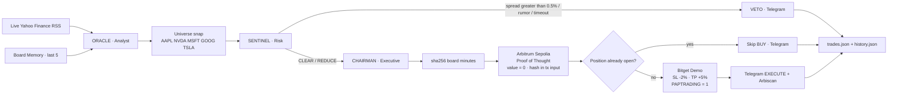

# CHRONOS-NEXUS

```text
 ██████╗██╗  ██╗██████╗  ██████╗ ███╗   ██╗ ██████╗ ███████╗
██╔════╝██║  ██║██╔══██╗██╔═══██╗████╗  ██║██╔═══██╗██╔════╝
██║     ███████║██████╔╝██║   ██║██╔██╗ ██║██║   ██║███████╗
██║     ██╔══██║██╔══██╗██║   ██║██║╚██╗██║██║   ██║╚════██║
╚██████╗██║  ██║██║  ██║╚██████╔╝██║ ╚████║╚██████╔╝███████║
 ╚═════╝╚═╝  ╚═╝╚═╝  ╚═╝ ╚═════╝ ╚═╝  ╚═══╝ ╚═════╝ ╚══════╝
███╗   ██╗███████╗██╗  ██╗██╗   ██╗███████╗
████╗  ██║██╔════╝╚██╗██╔╝██║   ██║██╔════╝
██╔██╗ ██║█████╗   ╚███╔╝ ██║   ██║███████╗
██║╚██╗██║██╔══╝   ██╔██╗ ██║   ██║╚════██║
██║ ╚████║███████╗██╔╝ ██╗╚██████╔╝███████║
╚═╝  ╚═══╝╚══════╝╚═╝  ╚═╝ ╚═════╝ ╚══════╝
```

### Wall Street sleeps. The Nexus does not.

**Autonomous multi-agent weekend arbitrage for tokenized US equities (rTokens)**  
Bitget AI Base Camp Hackathon S2 · Track: **Agentic Trading** · Mode: **Paper / Demo only** · Version: **0.5.0-universe**

[](https://www.python.org/)
[-8E75B2?style=for-the-badge)](https://ai.google.dev/)
[](https://www.bitget.com/api-doc/classic/demotrading/restapi)
[](https://sepolia.arbiscan.io/)
[](https://core.telegram.org/bots/api)
[](https://finance.yahoo.com/news/rssindex)
[](#license)

Cash US equities close. Macro does not. Tokenized names (`rAAPL`, `rNVDA`, `rMSFT`, `rGOOG`, `rTSLA`) keep trading 24/7 on Bitget while NYSE / NASDAQ are dark. **Chronos-Nexus** is a three-agent Board of Directors that **reads the live tape**, **picks the asset from the news**, **stress-tests rumor quality and L2 spread**, **anchors the decision on Arbitrum Sepolia**, and **dispatches a Bitget Demo paper order** with stop-loss, take-profit, and Telegram proof — plus a local, append-only audit ledger.

The LLM is the decision-maker, not a chatbot. SENTINEL holds a binding veto. No live capital is reachable from this tree. **Zero dummy data. Zero hardcoded tickers. Zero silent hangs.**

---

## Production upgrades — what judges should look at first

This is no longer a single-ticker demo. The Nexus is a **production-grade weekend desk**: live wire, dynamic universe, Python-enforced risk rails, on-chain Proof of Thought, and a crash-proof CIC.

| # | Capability | What it actually does |
|---|---|---|
| **1** | **Dynamic Multi-Token Universe** | ORACLE no longer trades a hardcoded `rNVDA`. It selects **one** listed Demo name from `AAPL / NVDA / MSFT / GOOG / TSLA` based on the live RSS context. |
| **2** | **Real-Time Data Ingestion** | Live **Yahoo Finance** (+ CoinTelegraph) RSS via `feedparser`. Top-3 newest headlines. **No canned weekend scenarios. No dummy prices.** |
| **3** | **Bulletproof Execution & Risk Guards** | Auto **Stop-Loss −2%** and **Take-Profit +5%**. **Position Awareness** refuses a second BUY if a book is already open. **L2 Spread Veto** halts if bid–ask **> 0.5%**. |
| **4** | **Telegram Live Alerts** | Boot ping, EXECUTE tickets with **Arbiscan Proof-of-Thought links**, and VETO / skipped-trade alerts — fire-and-forget, never crash the CIC. |
| **5** | **Agent Memory & Anti-Crash** | Last **5** cycles in `data/history.json` (JSON ring buffer). Gemini, Bitget, RSS, Telegram, and Sepolia sit behind **exponential backoff** and a **15s hard timeout**. |

```
 LIVE RSS  →  ORACLE picks 1 of 5 names  →  SENTINEL L2 / rumor / veto
      │                                         │
      │                                         ├─ VETO ──────────────► Telegram + trades.json
      │                                         │
      ▼                                         ▼ CLEAR / REDUCE
 BOARD MEMORY (last 5)                    sha256(board minutes)
      │                                         │
      └─────────────────────────────────────────┤
                                                ▼
                                   Arbitrum Sepolia  ·  value = 0
                                   CHRONOS-NEXUS/v1:{hash}
                                                │
                                                ▼
                                   Bitget Demo  ·  PAPTRADING=1
                                   SL −2%  ·  TP +5%  ·  no double-buy
                                                │
                                                ▼
                                   Telegram EXECUTE + Arbiscan proof
                                   data/logs/trades.json  ·  history.json
```

---

## Elevator pitch

Weekend geopolitics, supply-chain shocks, and tech-capex leaks hit the tape while cash equity is closed. Human desks wait for Sunday night futures and Monday’s cash open. rTokens already moved.

Chronos-Nexus runs that window as an **event → debate → risk clearance → on-chain Proof of Thought → guarded paper execution** loop:

| Pain | What the Nexus does |
|---|---|
| Wall Street is closed; rTokens are not | ORACLE prices Monday gap risk on the **live** 24/7 tape |
| One hardcoded ticker is a toy | The desk **rotates AAPL / NVDA / MSFT / GOOG / TSLA** from the headlines |
| Weekend “news” is often rumor | SENTINEL scores fake-news / black-swan and may **VETO** or **REDUCE** |
| Wide books eat paper fills | Python **L2 spread veto** if bid–ask **> 0.5%** (`Illiquid Market / High Spread`) |
| Agentic trades are unauditable | CHAIRMAN hashes the board minutes and anchors `sha256` on **Arbitrum Sepolia** |
| Unguarded fills | Auto **SL −2% / TP +5%** + **position-already-open** lock |
| Hackathon / evaluation risk | Bitget **Demo only** (`set_sandbox_mode(True)`, `PAPTRADING=1`) |

**Live E2E (this repo, 2026-09-10 UTC):** Gemini auto-resolved Flash · board debate completed · Sepolia attestation mined · Bitget Demo paper order `1481850718917124096` submitted on `NVDA/USDT:USDT`.

---

## Table of contents

1. [Killer features](#killer-features)
2. [Autonomous multi-agent architecture](#autonomous-multi-agent-architecture-board-of-directors)
3. [Testnet / paper-trading compliance](#testnet--paper-trading-compliance)
4. [Production / mainnet migration](#production--mainnet-migration-guide)
5. [Quickstart](#quickstart--setup)
6. [Verifiable audit trail & on-chain proofs](#verifiable-audit-trail--on-chain-proofs)
7. [Repository map](#repository-map)
8. [License](#license)

---

## Killer features

### 1. Dynamic Multi-Token Universe

The system **does not** rely on a hardcoded token. ORACLE must copy `primary_symbol` **exactly** from the Demo universe; Python then snaps aliases (`rAAPL`, `GOOGL`, `AAPL/USDT`) onto a listed market.

```python
# main.py — Bitget Demo stock-perp universe
TOKEN_UNIVERSE = [
    "AAPL/USDT:USDT",
    "NVDA/USDT:USDT",
    "MSFT/USDT:USDT",
    "GOOG/USDT:USDT",
    "TSLA/USDT:USDT",
]
```

| Live wire signal | Name the desk is allowed to pick |
|---|---|
| iPhone / Apple hardware / App Store / Tim Cook | **AAPL** |
| AI chips / GPUs / CUDA / NVIDIA / general AI beta | **NVDA** |
| Azure / Copilot / OpenAI partnership / Satya | **MSFT** |
| Search / YouTube / Android / Alphabet / Google | **GOOG** |
| EVs / autonomy / Tesla / Musk automotive | **TSLA** |

If several names hit, ORACLE takes the **highest-beta expression of the dominant headline**. `snap_to_universe()` is the last line of defense — the model cannot invent `rNVDA/USDT` or any off-list ticker.

Demo venues often do not list the cash rToken (`rNVDA/USDT`). The executor maps the thesis onto a listed Demo proxy (verified: **`NVDA/USDT:USDT`** stock perp, and the same pattern for AAPL / MSFT / GOOG / TSLA). That is a **venue constraint**, not a thesis change. SENTINEL is instructed not to veto solely because the rToken ticker is unlisted.

---

### 2. Real-Time Data Ingestion

**Zero dummy / hardcoded weekend macro.** ORACLE pulls the top 3 live items from:

| Source | Feed |
|---|---|
| **Yahoo Finance** | `https://finance.yahoo.com/news/rssindex` |
| **CoinTelegraph** | `https://cointelegraph.com/rss` |

Pipeline (`agents/analyst.py` → `fetch_live_wire()`):

1. Parallel HTTP GET (8s timeout, exponential backoff, `feedparser` with XML fallback).
2. Rank by published timestamp. Deduplicate headlines.
3. Classify (`geopolitical` · `supply-chain` · `macro` · `crypto` · `tech-shift` · `live-wire`).
4. Map names onto the universe (`pick_symbol_from_news`).
5. If both feeds are dark: **WIRE-FAIL** — ORACLE **will not invent** weekend macro.

Bitget last / bid / ask / L2 book are live CCXT Demo calls. A missing last price is `NO_LIVE_PRICE` / `STAND_DOWN`, not a fabricated fill.

Install the wire stack with everything else:

```bash
pip install -r requirements.txt
```

That pulls **`feedparser`** (RSS), `requests`, `ccxt`, `web3`, `google-genai`, `rich`, and `pydantic`. Do not skip it.

---

### 3. Bulletproof Execution & Risk Guards

Python owns these. Prompts cannot talk the desk around them.

| Guard | Rule | Enforcement |
|---|---|---|
| **Auto Stop-Loss** | **−2%** from fill / last | `STOP_LOSS_PCT = 0.02` — attached on BUY (swap `stopLossPrice`, then reduce-only stop) |
| **Auto Take-Profit** | **+5%** from fill / last | `TAKE_PROFIT_PCT = 0.05` — attached on BUY (swap `takeProfitPrice`, then reduce-only limit) |
| **Position Awareness** | No double-buying an open book | `fetch_open_position()` before BUY → status `POSITION_ALREADY_OPEN` · amount `0` |
| **L2 Spread Veto** | Halt if order-book spread **> 0.5%** | SENTINEL + Python: verdict forced to **VETO**, reason exactly `Illiquid Market / High Spread` |
| **Binding SENTINEL veto** | `VETO` → `STAND_DOWN` | CHAIRMAN cannot override. Size multiplier forced to `0.0` |
| **Size clamp** | Paper notional tiny | Default **15 USDT**, hard ceiling **50** |
| **Live-trading deadman** | Demo only | `LIVE_TRADING_ENABLED = False`; connector refuses `BITGET_PAPER_TRADING=false` |

```text
BUY fill @ P
   ├─ Stop-Loss     @ P × 0.98     (−2%)
   └─ Take-Profit   @ P × 1.05     (+5%)

L2 spread = (ask − bid) / mid × 100
   └─ if spread > 0.5%  OR  book crossed  →  VETO  (Python, not the model)
```

Crossed books (ask ≤ bid) are treated as illiquid. Spread is measured from the **live L2 book**, with ticker bid/ask only as a last-resort snapshot — never invented levels.

---

### 4. Telegram Live Alerts

Optional but first-class. Disarmed if `TELEGRAM_BOT_TOKEN` or `TELEGRAM_CHAT_ID` is empty — the CIC still runs. Armed, it is a remote command deck.

| Event | What you receive |
|---|---|
| **System startup** | `Chronos-Nexus is ONLINE and monitoring the tape.` (synchronous boot ping — credentials proven before the cycle) |
| **EXECUTE** | Symbol, side, amount, **SL −2%**, **TP +5%**, Bitget order id, **Arbiscan Proof-of-Thought link** |
| **VETO** | SENTINEL rationale, symbol, black-swan flags, model |
| **Skipped trade** | `Trade Skipped: Position already open for {SYMBOL}` |

Alerts are **async HTML** (`utils/notifier.py`). Failures print `[TELEGRAM ERROR]` and never raise into the board. Exponential backoff on 429 / timeout.

---

### 5. Agent Memory System & Anti-Crash

#### Memory — last 5 trades, ring buffer

`core/memory.py` → `data/history.json`

ORACLE and CHAIRMAN inject a compact recap into Gemini so the desk **does not blindly repeat** an identical failed side+symbol on the same news cluster.

```json
{
  "updated": "2026-09-10T12:00:00+00:00",
  "max_trades": 5,
  "trades": [
    {
      "ts": "…",
      "news_context": ["live headline 1", "live headline 2"],
      "decision": { "action": "EXECUTE", "side": "buy", "symbol": "NVDA/USDT:USDT", "verdict": "CLEAR" },
      "result": { "ok": true, "status": "submitted", "order_id": "…" }
    }
  ]
}
```

First boot hydrates from `data/logs/trades.json` if the ring is empty. Atomic write (`*.json.tmp` → replace). Window is **exactly 5**.

#### Anti-crash — exponential backoff + 15s hard timeout

External rails **degrade closed**. They do not hang the CIC.

| Rail | Timeout | Backoff |
|---|---|---|
| **Gemini** `generateContent` | **15s** hard cap (`GEMINI_TIMEOUT_S`) + daemon-thread join | 3 attempts, retry 429 / timeout / 5xx |
| Gemini catalog / HTTP | 15_000 ms SDK timeout | `call_with_backoff` |
| RSS GET | 8s | 3 attempts |
| Telegram `sendMessage` | 12s | 3 attempts |
| Bitget CCXT | 20s exchange timeout | 3 attempts |
| Arbitrum RPC | 20s | 3 attempts |

Backoff (`core/retry.py`): 3 attempts, base **0.75s**, cap **6s**, exponential. **Does not retry** auth failures, insufficient margin, or invalid orders.

If Gemini times out: agents emit **`VETO: API Timeout`**, SENTINEL vetoes, CHAIRMAN stands down, the ledger still writes. Unhandled faults in `main()` are swallowed into a **NEXUS DEGRADED** panel — process exit `1`, not a traceback dump on the judges’ screen.

---

## Autonomous multi-agent architecture (Board of Directors)

Three callsigns. One thesis. Python enforces the risk contract so the model cannot talk its way around a veto.

| Callsign | Agent | File | Mandate |
|---|---|---|---|
| **ORACLE** | Analyst | `agents/analyst.py` | Ingest **live** Yahoo / CoinTelegraph RSS. Translate it into a **Monday cash-gap** thesis and a **single** universe name (`side`, `conviction`, `primary_symbol`). Reads board memory. |
| **SENTINEL** | Risk Manager | `agents/risk_manager.py` | Stress-test rumor quality, black-swan flags, **L2 spread > 0.5%**, weekend gap-through risk, concentration. Verdicts: **CLEAR** · **REDUCE** · **VETO**. Veto is binding. |
| **CHAIRMAN** | Executive | `agents/executive.py` | Synthesize the debate (memory-aware), lock the action, SHA-256 the board minutes, call `log_proof_of_thought()`, then `execute_paper_order()` with SL/TP. |

### Risk contract (non-negotiable)

| SENTINEL verdict | CHAIRMAN action | Size |
|---|---|---|
| `CLEAR` | `EXECUTE` | Full paper notional cap |
| `REDUCE` | `EXECUTE` | `max_notional_usdt × size_multiplier` |
| `VETO` | `STAND_DOWN` | Zero — Python overrides any model that tries to trade |
| API timeout / no live last | `STAND_DOWN` | Zero — degraded closed |

### Lifecycle



Cortex and rails are not agents. They are infrastructure the board calls:

| Layer | Module | Role |
|---|---|---|
| Cortex | `core/config.py`, `core/llm.py` | `GEMINI_MODEL=auto` lists live `generateContent` models and binds the fastest stable **Flash**. **15s** generate timeout. |
| Memory | `core/memory.py` | JSON ring buffer — last 5 cycles in `data/history.json` |
| Retry | `core/retry.py` | Exponential backoff for Gemini, Bitget, RSS, Telegram, Sepolia |
| Schemas | `core/schemas.py` | Pydantic contracts between agents and rails |
| Paper rail | `connectors/bitget_paper.py` | CCXT Bitget, sandbox first, Demo header, SL/TP, position lock, audit append |
| Attest rail | `connectors/arbitrum.py` | web3.py, chain ID **421614**, 0-value Proof of Thought |
| Alerts | `utils/notifier.py` | Telegram startup / EXECUTE / VETO / skip |
| Command deck | `main.py` | High-contrast Rich UI — boot → ingest → debate → attest → execute |

### Dynamic auto-model resolver

`GEMINI_MODEL=auto` queries the live Gemini catalog (`google-genai`, with `google-generativeai` as fallback), keeps text `generateContent` models, drops image / live / TTS / embed, and scores **stable Flash over Pro, newest over oldest**.

Verified at boot: **40** chat-capable models discovered → resolved **`gemini-3.8-flash`**. Fallback chain (if a generation fails):

`gemini-3.8-flash → 3.7-flash → 3.6-flash → 3.5-flash → 2.5-flash → 2.5-flash-lite → 1.5-flash → 1.5-pro`

No hardcoded stale ID. No paid “router” service. Pin a model by setting `GEMINI_MODEL=gemini-1.5-flash` (or any listed id).

### Cryptographic Proof of Thought

Before the paper order is sent, CHAIRMAN canonicalizes the board minutes (ORACLE + SENTINEL + action/size/symbol) and SHA-256s them. `connectors/arbitrum.py` submits a **zero-value self-transaction** on Arbitrum Sepolia whose `input` data is:

```text
CHRONOS-NEXUS/v1:{64-char sha256}
```

Anyone can recompute the hash from `trades.json` and match it to the tx calldata on [Sepolia Arbiscan](https://sepolia.arbiscan.io/). Insufficient gas is a skipped attestation, not a crash — the paper ledger still writes. Telegram EXECUTE alerts deep-link the explorer URL as **Proof**.

### Matrix command deck

`main.py` is a terminal-native CIC: ASCII banner, compliance lock, real Gemini / Bitget / Sepolia / Telegram / memory health, live-wire table, **token universe panel**, dual-panel ORACLE vs SENTINEL debate, CHAIRMAN decision, attestation explorer URL, paper-order panel with **SL −2% / TP +5%**. Built with [Rich](https://github.com/Textualize/rich). Use **Windows Terminal** (or any UTF-8 truecolor host).

---

## Testnet / paper-trading compliance

This repository is built for **Bitget AI Base Camp Hackathon S2** evaluation. It will not spend real funds.

| Surface | Lock | How it is enforced |
|---|---|---|
| Bitget | Demo / paper only | `BITGET_PAPER_TRADING=true` required. `ccxt.bitget(...); exchange.set_sandbox_mode(True)` is the **first** call after construct. Header `PAPTRADING: 1`. |
| Bitget keys | Demo API key | Create under **Bitget → Demo mode → API Key Management**. Live keys are the wrong environment. |
| Arbitrum | Sepolia, chain ID **421614** | RPC default `https://sepolia-rollup.arbitrum.io/rpc`. `eth_chainId` is checked; mismatch aborts attest. |
| Value transfer | None | Proof-of-Thought `value = 0`, `to = from` (self-tx). Payload is calldata only. |
| Process flag | Deadman | `LIVE_TRADING_ENABLED = False` — boot returns `2` if flipped on without a deliberate code change. |

```python
# connectors/bitget_paper.py — sandbox is not optional
exchange = ccxt.bitget({..., "headers": {"PAPTRADING": "1"}})
exchange.set_sandbox_mode(True)  # first call after construct
```

```python
# core/config.py
def assert_paper_trading(self) -> None:
    # REFUSING TO BOOT unless BITGET_PAPER_TRADING is true
```

Evaluators: claim **Bitget Demo virtual USDT** before a fill is possible. An unfunded Demo wallet records `INSUFFICIENT_MARGIN` in `trades.json` rather than failing closed-loop silently.

---

## Production / mainnet migration guide

**This tree ships with the hackathon deadman on.** Flipping one env var is **not** enough while those gates remain. That is intentional. Forks that want mainnet should treat the lift as a conscious, reviewed change — not a hidden default.

### What does *not* change

Agent prompts, risk contract (veto, L2 spread, SL/TP, position lock), hashing, Rich lifecycle, Telegram, board memory, and the Executive sequence (`synthesize → attest → execute`) stay the same. You are swapping **rails and keys**, not rewriting the board.

### 1. Environment

```dotenv
# Bitget live (replace Demo API key with a live key — never commit it)
BITGET_PAPER_TRADING=false
BITGET_API_KEY=                         # live key
BITGET_API_SECRET=
BITGET_PASSPHRASE=
BITGET_SYMBOL=rNVDA/USDT                # live rToken spot, if listed

# Arbitrum One (chain ID 42161) — not Sepolia 421614
ARBITRUM_SEPOLIA_RPC=https://arb1.arbitrum.io/rpc
ARBITRUM_SEPOLIA_CHAIN_ID=42161
ARBITRUM_PRIVATE_KEY=                   # mainnet key; 0-value attest still recommended

# Telegram stays the same
TELEGRAM_BOT_TOKEN=
TELEGRAM_CHAT_ID=
```

`ARBITRUM_SEPOLIA_*` names are historical; they currently carry whatever RPC / chain ID you set. Point them at One when you migrate.

### 2. Code gates you must lift (explicit)

| Gate | File | Today | Mainnet fork |
|---|---|---|---|
| Boot deadman | `main.py` | `LIVE_TRADING_ENABLED = False` | Set `True` only after review |
| Settings assert | `core/config.py` → `assert_paper_trading()` | Refuses `BITGET_PAPER_TRADING=false` | Allow false / split Demo vs live factory |
| Connector refuse | `connectors/bitget_paper.py` | `if not settings.bitget_paper_trading: raise` | Construct **without** `set_sandbox_mode(True)` and **without** `PAPTRADING=1` |
| Chain allow-list | `connectors/arbitrum.py` | Expects `421614` | Expect `42161` (Arbitrum One) |
| Explorer | `EXPLORER_TX` | `sepolia.arbiscan.io` | `arbiscan.io` |

After those gates are lifted, CHAIRMAN still: hash → 0-value attest → `create_order` with SL/TP. No second execution path.

### 3. Operational checklist (do not skip)

1. Use a **dedicated sub-account** with a hard loss cap. Prefer Bitget Agentic / Demo until the paper Sharpe is boring.
2. Size is still SENTINEL-capped; raise `paper_notional_usdt` only with a written policy.
3. Confirm live symbols (`rNVDA/USDT` vs `NVDA/USDT:USDT`, plus AAPL / MSFT / GOOG / TSLA) with `load_markets()` — Demo listings ≠ production listings.
4. Fund the attester with a dust amount of ETH on **Arbitrum One** (still `value = 0`).
5. Keep `data/logs/trades.json`, `data/history.json`, and the explorer URL as the triple ledger.
6. Keep Telegram armed so VETO / skip / fill is visible off-box.

If you are evaluating this hackathon entry, **do not migrate**. Run Demo + Sepolia as shipped.

---

## Quickstart & setup

### Prerequisites

- Python **3.10+** (verified on 3.12)
- Git
- A [Gemini API key](https://aistudio.google.com/apikey)
- Bitget **Demo** API key + secret + passphrase  
  Path: Bitget → **Demo trading** → API Key Management
- An Arbitrum **Sepolia** account with a small ETH balance (faucet) for 0-value txs
- Virtual Demo USDT claimed on Bitget Demo (required for a fill)
- Optional: a Telegram bot token + chat id for live alerts  
  Path: [@BotFather](https://t.me/BotFather) → create bot → message the bot → resolve `chat_id`

### Step 1 — Clone

```bash
git clone https://github.com/YOUR_ORG/Chronos-Nexus.git
cd Chronos-Nexus
```

Windows PowerShell:

```powershell
git clone https://github.com/YOUR_ORG/Chronos-Nexus.git
cd Chronos-Nexus
```

### Step 2 — Virtualenv & dependencies

**Required.** New production rails depend on packages that are not in the stdlib — notably **`feedparser`** (live Yahoo Finance RSS), `requests` (Telegram + RSS), `ccxt`, `web3`, and the Gemini SDKs.

```bash
python -m venv .venv
# Windows:
.\.venv\Scripts\Activate.ps1
# macOS / Linux:
# source .venv/bin/activate

python -m pip install --upgrade pip
pip install -r requirements.txt
```

If PowerShell blocks activation:

```powershell
Set-ExecutionPolicy -Scope Process -ExecutionPolicy Bypass
.\.venv\Scripts\Activate.ps1
```

### Step 3 — Configure `.env`

```powershell
copy .env.example .env
```

```bash
cp .env.example .env
```

Fill values (never commit `.env`):

```dotenv
# --- LLM (GEMINI_MODEL=auto resolves the fastest stable Flash) ---
GEMINI_API_KEY=your_gemini_key
GEMINI_MODEL=auto

# --- Bitget Paper Trading (Demo API key — NOT a live key) ---
BITGET_API_KEY=your_demo_api_key
BITGET_API_SECRET=your_demo_secret
BITGET_PASSPHRASE=your_demo_passphrase
BITGET_PAPER_TRADING=true
BITGET_SYMBOL=rNVDA/USDT

# --- Arbitrum Sepolia (chain ID 421614) ---
ARBITRUM_SEPOLIA_RPC=https://sepolia-rollup.arbitrum.io/rpc
ARBITRUM_SEPOLIA_CHAIN_ID=421614
ARBITRUM_PRIVATE_KEY=0xyour_sepolia_private_key

# --- Telegram live alerts (optional; disarmed if empty) ---
TELEGRAM_BOT_TOKEN=123456:ABC-your-bot-token
TELEGRAM_CHAT_ID=your_numeric_chat_id
```

`TELEGRAM_BOT_TOKEN` and `TELEGRAM_CHAT_ID` are first-class settings in `core/config.py`. Leave them blank to run headless; fill both to arm startup / EXECUTE / VETO / skip alerts.

### Step 4 — Run the board

```bash
python main.py
```

Expected phases:

1. Kernel / compliance lock (paper + Telegram armed/disarmed)
2. Gemini cortex (auto-select, 15s timeout)
3. Bitget Demo + Arbitrum Sepolia health
4. Board memory window (`data/history.json`, last 5)
5. **Live** Yahoo Finance / CoinTelegraph ingest
6. Token universe panel → ORACLE picks **one** of AAPL / NVDA / MSFT / GOOG / TSLA
7. Live L2 book + SENTINEL debate (spread veto if **> 0.5%**)
8. CHAIRMAN — Proof of Thought + paper order with **SL −2% / TP +5%**
9. Telegram dispatch (EXECUTE with Arbiscan link, or VETO / skip)

Press Enter to shut down. Full minutes land in `data/logs/trades.json`. The ring buffer updates `data/history.json`.

### Tests

```bash
python -m unittest discover -s tests -v
```

---

## Verifiable audit trail & on-chain proofs

### Local ledgers

| File | Role |
|---|---|
| `data/logs/trades.json` | Append-only paper ledger — every `EXECUTE`, `VETOED`, `POSITION_ALREADY_OPEN`, `INSUFFICIENT_MARGIN`, `NO_LIVE_PRICE`, or venue `ERROR` |
| `data/history.json` | Last **5** cycles for ORACLE / CHAIRMAN memory |

Each trade record carries: ISO timestamp, `sandbox: true`, `live_trading: false`, symbol / side / amount, `reasoning_hash`, ORACLE brief, SENTINEL report (including `spread_pct`), CHAIRMAN decision, attestation blob, **SL/TP prices and order ids**, and the Bitget order id when the Demo API accepts the ticket.

### Hash schema

```text
reasoning_hash = sha256( json.dumps({
    analyst, risk, action, symbol, side, amount, notional_usdt, reasoning
}, sort_keys=True, separators=(',', ':')) )
```

On-chain `input` (hex-decoded ASCII):

```text
CHRONOS-NEXUS/v1:{reasoning_hash}
```

### Verified Sepolia attestations (this repo)

| UTC | `reasoning_hash` | Tx | Result |
|---|---|---|---|
| 2026-09-10 07:30 | `0b36683f…e1306cc7` | [`0x1b3ecc83…556fe721`](https://sepolia.arbiscan.io/tx/0x1b3ecc83c316e46dc7b18edb3b86da96c04a57d8af6eb68765542b96556fe721) | Anchored (`value = 0`, chain **421614**) |
| 2026-09-10 07:51 | `a51fd447…d2cda5b6` | [`0xacf4e0ea…fde73b24`](https://sepolia.arbiscan.io/tx/0xacf4e0ea402cc66e03984e307c349094be088acc7b499e6eb0a381aefde73b24) | Anchored, then **Bitget Demo order `1481850718917124096`** on `NVDA/USDT:USDT` |

Attester (Sepolia): [`0x9AFe5CeF11fC10756faef213f7A30D9873B5d372`](https://sepolia.arbiscan.io/address/0x9AFe5CeF11fC10756faef213f7A30D9873B5d372)

Recompute from the matching object in `trades.json` and compare to the tx input on Arbiscan. That is the sponsor-visible on-chain validation path. Telegram EXECUTE alerts carry the same explorer URL.

### Example paper ticket (sanitized)

```json
{
  "venue": "bitget-demo",
  "sandbox": true,
  "live_trading": false,
  "symbol": "NVDA/USDT:USDT",
  "side": "buy",
  "status": "submitted",
  "order_id": "1481850718917124096",
  "sl_price": 169.54,
  "tp_price": 181.65,
  "sl_pct": -2.0,
  "tp_pct": 5.0,
  "reasoning_hash": "a51fd447b0df32db758ad6642a1f7923117aec31b0fab872e0872113d2cda5b6",
  "attestation": {
    "ok": true,
    "tx_hash": "0xacf4e0ea402cc66e03984e307c349094be088acc7b499e6eb0a381aefde73b24",
    "chain_id": 421614,
    "reason": "anchored"
  }
}
```

---

## Repository map

```text
Chronos-Nexus/
├── main.py                      # Rich CIC + demo lifecycle (v0.5.0-universe)
├── requirements.txt             # includes feedparser (live RSS)
├── .env.example                 # copy to .env — never commit secrets
├── agents/
│   ├── analyst.py               # ORACLE — live RSS + universe snap
│   ├── risk_manager.py          # SENTINEL — veto + L2 spread > 0.5%
│   └── executive.py             # CHAIRMAN — memory, attest, execute
├── core/
│   ├── config.py                # dotenv, paper lock, Gemini auto-select, Telegram
│   ├── llm.py                   # Gemini cortex · 15s hard timeout
│   ├── memory.py                # last-5 ring buffer → data/history.json
│   ├── retry.py                 # exponential backoff for every rail
│   └── schemas.py               # Pydantic board contracts
├── connectors/
│   ├── bitget_paper.py          # Demo / PAPTRADING=1 · SL/TP · position lock
│   └── arbitrum.py              # Sepolia Proof of Thought
├── utils/
│   └── notifier.py              # Telegram startup / EXECUTE / VETO / skip
├── data/
│   ├── history.json             # agent memory (ring of 5)
│   └── logs/trades.json         # append-only paper ledger
├── contracts/                   # reserved for a future attest contract
└── tests/
    ├── test_phase1_live.py
    └── test_phase2_safety.py
```

---

## Disclaimer

Chronos-Nexus is research / hackathon software. The weekend wire is **live RSS**, not a licensed news terminal and not a warranty of completeness. Tokenized equity products and Demo listings differ by region and account. Stop-loss / take-profit placement depends on Bitget Demo order-type support; prices are always recorded even if a venue rejects the protective ticket. Nothing here is investment advice. Do not point this process at live keys unless you have lifted the documented gates and accept the loss.

---

## License

MIT. Use, fork, and modify with attribution. Keep Demo keys, Telegram tokens, and mainnet keys out of git.

---

**CHRONOS-NEXUS** — *Bitget AI Base Camp Hackathon S2 · Agentic Trading*  
ORACLE · SENTINEL · CHAIRMAN  
**Live wire. Five names. Binding veto. On-chain proof. Paper only.**
